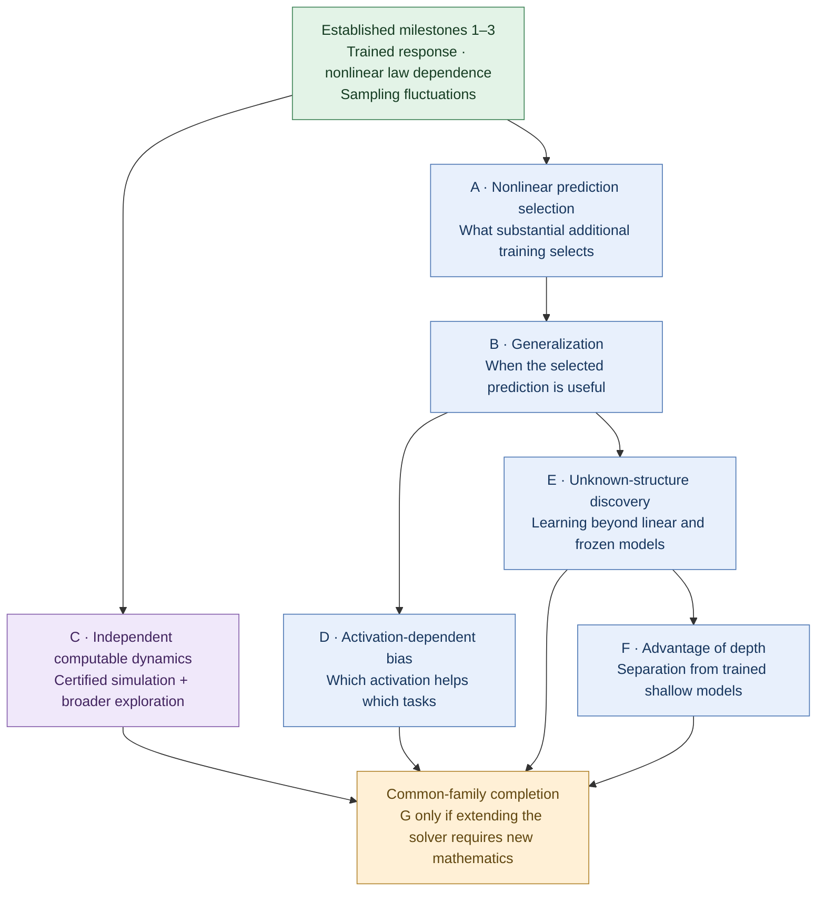

# Established theory: a reading guide

This is a modular mathematical library, not a chronological research diary.
Start with [shared notation](NOTATION.md); each chapter then states its exact
model, hypotheses, claim and proof. A local theorem, a special-data theorem and
a benchmark for a different architecture are not interchangeable.

## The scientific question

The project concerns two related mysteries. The first is training: how a deep
network follows an organized learning trajectory through a highly nonconvex
parameter space. The second is more demanding: why the representations selected
by that trajectory can be useful on examples that did not participate in
training. A theory of successful optimization is an important starting point,
but it does not answer the second question. This book presently develops tools
and exact-capture results for the first, while keeping the second as the reason
for studying the internal dynamics rather than only the training loss.

Can a deep, genuinely nonlinear network with learned hidden features be
understood as an approximation of an autonomous, uniquely restartable
population evolution? The desired comparison is joint in width and the actual
gradient-descent step, uniform on each finite physical-time interval, and
includes internal representations and the two directions of reused matrices,
not just predictions.

The limiting object should simplify the description without deleting the
mechanism under investigation. A finite number of function or operator fields
can organize an infinite-dimensional state. It need not collapse to finitely
many scalar moments. Its forward and adjoint actions must remember that the
same matrices are used repeatedly in forward propagation, backpropagation and
training. After reuse, a new matrix output contains a response determined by
previous uses together with unexplored Gaussian randomness; declaring it an
independent fresh Gaussian would remove part of the learning dynamics.

Width and time perform different roles in this approximation. Finite width
provides random empirical populations and matrix actions, not necessarily a
spatial grid. Raw GD is a time discretization in the actual trainable
parameters. A width theorem for every separately fixed number of updates does
not supply estimates uniform in the growing number of updates needed when
the step tends to zero. Conversely, a finite-width continuous flow alone says
nothing about the existence or uniqueness of its population limit. A joint
theorem must connect these approximations with an explicit step condition,
topology, mode of convergence and observable contract.

The resulting equations should support restart from their stated admissible
states, with uniqueness there. A convergent endpoint of an already existing
path does not by itself construct or identify the subsequent path. Nor is a
candidate self-consistency equation a convergence theorem. These obligations
are part of exact capture, not optional refinements after finding attractive
formal equations.

### What the theory must preserve

The intended dense-network question retains correlated data, ordinary Gaussian
initialization, nonlinear activations and genuine hidden learning. Freezing
features, imposing orthogonality or whitening, or changing the architecture to
make a proof easy would answer a different question. Explicitly separated
linear and residual-particle benchmarks are useful comparisons, not substitutes.

This is a mechanism-preservation requirement, not a list of forbidden tricks
whose omissions invite equivalent replacements. The population/GF regime is
useful because finite networks can be compared with it. Normalizing input
lengths leaves their angles and correlations available to the theory. By
contrast, forcing all samples to be orthogonal, discarding the Gaussian matrix
bulk, or prescribing a special low-rank initialization can remove precisely the
interactions the main question seeks to explain. Such models may still be
valuable benchmarks if their different role is explicit.

Nonlinearity must be checked on the distributions actually visited, not only
in the written activation formula. Hidden learning requires motion of the
relevant representations at the claimed scale, not merely a nonzero activation
derivative or moving readout. A nonzero initial acceleration, positive gate
mass, persistent feature velocity and a lower bound on relative nonlinear
strength are distinct properties. A fixed-depth theorem with nonzero absolute
nonaffinity need not retain a uniform relative nonlinear contribution as depth
or an activation gain changes. The chapters state these distinctions instead
of treating all activity certificates as equivalent.

Smoothness and boundedness assumptions can define useful sufficient classes;
their role should be exposed in the estimates. Failure of an estimate for one
activation is not evidence that the whole learning regime is impossible.
Likewise, allowing constants to depend on a fixed correlated dataset is not
the same as proving uniformity over nearly coincident samples. Identical inputs
with incompatible labels obstruct exact interpolation by a deterministic
predictor, but do not obstruct defining its dynamics. Noisy data also require
a suitable achievable-risk target rather than an assumption that all noise
can be removed.

### Approximation through a prescribed training accuracy

Capturing the path and proving that it fits are separate tasks. Energy
dissipation alone gives a nonincreasing loss; it does not exclude a positive
limiting loss. A fitting argument needs additional control along training,
for example in the actual residual direction. Initial conditioning by itself
does not supply that control at later times.

Once compact-time loss approximation and population fitting are both proved
for the same model, they combine without interchanging an infinite training
time and the width limit. To make this precise, let `mathcal L(t)` be the
deterministic population loss and let `mathcal L_(n,eta_n)(t)` denote the loss
of the interpolated raw-GD network, under the chapter's admissible joint
scaling. Suppose the latter converges in probability uniformly on every fixed
finite interval and `mathcal L(t)` tends to zero. For any `epsilon>0`, choose
one finite `T_epsilon` with `mathcal L(T_epsilon)<=epsilon/2`. Then

\[
\mathbb P\{\mathcal L_{n,\eta_n}(T_\varepsilon)>\varepsilon\}
\le
\mathbb P\left\{\sup_{0\le t\le T_\varepsilon}
|\mathcal L_{n,\eta_n}(t)-\mathcal L(t)|>\varepsilon/2\right\}
\longrightarrow0.
\]

The inclusion of events proves the assertion directly. It gives high-probability
accuracy at a prescribed finite time and path approximation up to that time,
provided the theorem includes the corresponding path observables. The same
argument applies to finite-width GF when its approximation is proved, or to
an attainable positive loss benchmark with the inequalities shifted by that
benchmark. It does not give one width sufficient for every accuracy, an
arbitrary growing-horizon bound, exact zero loss in finite time, or convergence
of final parameter endpoints. Quantitative width and step requirements require
quantitative approximation estimates in addition to this argument.

### Beyond fixed depth and a fixed dataset

Two further population questions should remain visible. A continuous-depth
description would organize representations across layers, typically with an
explicit residual scaling. An input-population description would replace a
fixed training list by a sampling distribution. Neither follows by simply
renaming an index in a fixed-depth, fixed-batch theorem. They require estimates
uniform in the new parameter, a specified architecture and sampling model, and
control of the interaction between the limits. Sequential width/depth limits
at initialization do not establish joint trained width/depth/time convergence.
The continuous-depth chapter therefore identifies its different architecture
before stating its positive result.

The bridge toward generalization begins with the learned map on passive test
inputs: inputs evaluated by the trained weights but absent from the updates.
One can then ask what the trajectory selects among predictors that fit the
training data, and whether that selection helps for a specified distribution.
Transport, variational or action-based descriptions are possible research
tools, not established explanations here. A generic energy identity or a
unique evolution has explanatory force for generalization only after an
additional argument connects the selected representations to out-of-sample
risk. Finite training correlations and successful transfer-panel experiments
alone would not establish that connection.

## Strategic roadmap: insight before breadth

This section records research objectives and the reasoning behind their order.
It is a plan, not an additional theorem or a claim that its later steps will
succeed. The established statements and their exact scopes remain in the
chapters listed below. Milestone letters A–F are planning labels, distinct
from the numbered sections of those chapters.

The intended destination is a coherent explanation of what deep nonlinear
training learns, why its predictions generalize, when depth and activation
help, and how the same population evolution can be computed independently.
The learning, comparison and computational conclusions must eventually apply
to substantially overlapping task families. Separate favorable examples for
different models would not establish this combined objective.

### Why these milestones are separated

The strategic choice is to isolate a tractable part of a hard problem that
still exposes an important learning mechanism. A fixed depth, a structured
family of correlated data, or one finite learning episode can support a deep
insight without simultaneously resolving arbitrary depth, arbitrary laws and
all-time dynamics. The restrictions must preserve the mechanism: ordinary
Gaussian initialization, actual matrix reuse, nonlinear activations and
learned hidden features. Freezing the feature dynamics or imposing a special
initialization that supplies the desired representation would change the
question rather than make progress on this route.

Each milestone should settle one substantial scientific obligation and remain
valuable if the next one fails. The count follows from these obligations;
proof lemmas, additional examples and routine integration are not automatically
new milestones. Successful results also change the next problem: a proof can
expose a better state space, a sharper task family or a simpler argument.
Recalibration after a completed milestone is therefore part of the design.

Breadth is postponed when it adds major technical cost without changing the
explanation. Universal fitting, a generic global Lyapunov construction,
arbitrary growing-horizon finite-width control and joint continuous-depth
limits are not prerequisites for this campaign. They remain possible subjects
of later concerted work, guided by a demonstrated mechanism. Their omission
here is not evidence of impossibility. Conversely, an extension is worth
prioritizing when it is needed to reveal a new mechanism: varying dimension or
task complexity can be essential to a meaningful depth or sample-efficiency
separation. The aim is neither maximal generality nor an isolated toy witness.

This postponement does not permit assuming away a milestone's decisive gap.
If a learning conclusion requires a tail bound, conditioning estimate or
continuation theorem, that obligation must be proved for the admitted family.
Conditional progress can be retained, but it does not complete the stronger
target. Restrictions and unresolved dependencies should remain visible.

### Established starting point and dependency map

In *Global nonlinear learning*, C.4.5 supplies the fitted two-hidden-layer
tanh reference and its whole-circle endpoint. The first three milestones
are established at the following scopes: C.4.6 captures actual finite-GF data
derivatives at that reference on every separately fixed horizon and gives
uniformly bounded population homogeneous propagation; C.4.7 constructs nearby
nonlinear changed-law flows through physical time 40 and a finite-contamination
remainder; C.4.8 supplies the actual influence field, Hilbert sampling limit
and mean-square remainder at time 40, with a width-first finite-GF bridge.
These statements retain the full Gaussian action and actual adjoint. They do
not by themselves prove broad useful generalization, architectural superiority
or an efficient independent numerical representation.

The arrows express the intended mathematical dependencies, not implications
already proved. The same dependency map is recorded in the table for readers
whose renderer does not display Mermaid diagrams. C can inform the other
directions empirically without being a prerequisite for their initial proofs.

| Milestone | Starting dependency | Scientific result sought |
|---|---|---|
| A | Established 1–3 | Nonlinear selection of the whole-input prediction |
| B | A and the established sampling calculus | Useful generalization of that selection |
| C | Established 1–3 | Independent computation and controlled broader exploration |
| D | B | An explanation of activation-dependent bias |
| E | B | Efficient discovery of unknown structure |
| F | E | A genuine advantage over trained shallow models |
| Common-family completion; G only if needed | C, D, E and F | Compatible conclusions and computation at the learning scales |

### A. Nonlinear prediction selection after substantial learning

Determine the whole-input prediction selected after finite, nonvanishing
adaptation to additional data, starting from the original initialization and
actual training law. A representative setting is
\(\mu_{\varepsilon,\nu}=(1-\varepsilon)\nu_*+\varepsilon\nu\), where
\(\nu_*=\tfrac12\delta_{(\sqrt2e_1,+1)}+
\tfrac12\delta_{(\sqrt2e_2,-1)}\) and \(\nu\) ranges over a nontrivial
family on \(\sqrt2S^1\times[-Y,Y]\), with fixed \(Y\ge1\).
Here \(e_1,e_2\) are the input coordinate unit vectors. Inputs outside the
reference pair need not be orthogonal.

The target is a determining characterization with controlled whole-circle
error and additional hidden adaptation. Write \(f_*^\infty\) for the fitted
reference prediction and \(P_\nu\) for the selected prediction. Seek a fixed
improvement \(R_\nu(f_*^\infty)-R_\nu(P_\nu)\ge a>0\), where
\(R_\nu(f)=\int(f(x)-y)^2\,d\nu(x,y)\). The margin must survive
the small-contamination and width limits on a specified robust subfamily;
it cannot disappear merely because the component has weight \(\varepsilon\).
Measure additional hidden motion against the matched reference evolution or
its justified hidden endpoint, rather than against initialization alone.
The original finite Gaussian readout, both orientations of the reused middle
action, and the exact model and training metric are retained. Population
continuation and actual finite-GF capture must be justified through the chosen
learning horizon, with explicit limit order.

One finite adaptation episode can suffice. A first derivative, formal jet,
restatement of the original parameter equations or small mixture loss alone
does not determine the requested nonlinear selection. The fitted endpoint,
response geometry and source estimates provide a concrete starting point;
control of accumulated adaptation remains the new obligation. This yields an
independent explanation of substantial nonlinear learning even if B fails.

### B. Generalization of the selected predictor

For a task family defined independently of the network's eventual answer,
connect the selected whole-input prediction to the regression target. Derive
population approximation error, sampling and noise control, and a justified
training horizon or stopping rule. The guarantee should improve with available
information or computational effort in a stated regime; finite-network
transfer must keep its proved scope.

The sampling limit in C.4.8 describes fluctuations around the population
predictor. It does not establish that this predictor is close to the desired
target, nor does its prediction-variance formula automatically identify excess
risk. A supplies the selection mechanism to analyze; B supplies the connection
to useful unseen predictions. This is valuable without an architectural
superiority theorem.

### C. Independent computation and broader empirical exploration

Construct a fundamentally different finite causal system approximating the
same population GF, with one physical time, explicit initialization and
prediction reconstruction. The certified target includes enough internal
observations to identify the evolution and support its claimed restartability,
including the effects of both Gaussian action directions and their reuse.
An autonomous ODE, PDE or integro-differential hierarchy is admissible; a fitted
surrogate or replay of the target trajectory is not.

Account for total storage, computation, precision, quadrature, field count and
memory cost. A collection of low-dimensional fields can qualify. A hidden
high-dimensional density, unevaluated Gaussian-action oracle or renamed
trainable fully connected matrix does not establish manageable computation.
The first theorem can cover an explicitly represented family of laws,
including nonatomic examples, through the established learning horizon. It
should attain useful accuracy within a concrete resource bound.

The second purpose is reliable empirical investigation beyond conservative
proof bounds. Make the construction reusable wherever its equations and
approximations remain meaningful, to investigate larger law perturbations,
broader input correlations, longer training and the resulting whole-input
predictions and risks. Such observations may reveal that a theorem's small
admissible neighborhood reflects its estimates rather than actual failure of
learning. This is a hypothesis to test, not a conclusion supplied by the plan.

Outside the certified regime, label results exploratory. Check refinement of
time discretization, resolution and truncation, relevant numerical errors,
and agreement with independently simulated finite networks as width increases
under stated step conditions. Finite networks already provide a simulation
route; C supplies an independent approximation to help separate population
behavior from finite-width and numerical effects. A stable-looking curve at
one resolution is insufficient. Broader empirical evidence does not prove
existence, convergence or generalization theorems, and changed depth or
architecture may require different equations. Experiments retain their own
authorization, reproducibility and review requirements.

### D. Activation-dependent inductive bias

Explain which task characteristics favor one activation over another through
the actual trained selection mechanism. Seek two genuinely different
activations and robust regimes with a meaningful crossover, including sampling
sensitivity where relevant. Initial kernel spectra can guide a proof but do
not replace analysis of trained nonlinear predictions.

Control initialization and output scales, training time and tuning opportunities.
Avoid manufacturing the comparison through scalar gain alone or a symmetry
mismatch that prevents one model from representing the task. Each activation
requires its own justified dynamical scope. B makes the comparison interpretable
in terms of task structure and risk. A successful D explains activation choice
even if efficient unknown-structure discovery remains open.

### E. Efficient discovery of unknown structure

Show how useful representations emerge without being supplied in the
initialization. On a substantial structured task family with unknown directions,
components or interactions, prove discovery and exploitation by the actual
jointly trained network, with explicit sample, training-time and finite-network
requirements. Finite GD claims retain their proved step conditions.

Establish class-level advantages over deep linear training and precisely
specified frozen-feature and initialized tangent-kernel alternatives. The
advantage may concern sample, parameter or computational scaling; it need not
exclude approximation by a much more expensive competitor. State resource
constraints and tuning opportunities fairly. A and B explain selection and
its usefulness; emergence from the original Gaussian initialization is E's
additional obligation. Response around a fitted reference alone does not
establish it.

### F. A genuine advantage of depth

Find a robust task class for which the actual deep training algorithm has a
learning guarantee that a trained one-hidden-layer alternative cannot match
under clearly stated resource or training constraints. Combine the deep upper
bound with an appropriate shallow approximation, statistical or optimization
lower bound. The explanation must identify useful nonlinear composition across
layers. Feature motion, sequential discovery or superiority over a frozen
kernel alone does not establish the shallow comparison.

E supplies actual discovery of unknown structure; F identifies structures for
which depth makes its exploitation substantially more efficient. A suitable
common task family and the required exact-model shallow obstruction remain
research obligations, not assumptions secured by the roadmap.

### Common-family completion and the possible milestone G

The final learning, activation, depth and computational results must have
substantial overlap in task families, models and learning regimes. C's solver
must cover the relevant horizons with error smaller than the claimed learning
and comparison margins. If C's approximation and complexity theorem already
provides this, completion is integration and verification. If extending it
requires new mathematics, that is a separate milestone G; its count is not
fixed in advance for presentation symmetry.

A possible missing obligation is controlling the necessary source modes or
memory using the learned structure. Low-dimensional structure in a target
does not automatically imply a small representation of the trained Gaussian
evolution. This computational compatibility and the exact-model shallow
separation are substantial uncertainties. Screen candidate families early
for compatibility rather than accumulating results that cannot be combined.

### Conditional GD fallback and recalibration

The current route uses the established GF foundation. Reconsider direct GD
when a milestone encounters a persistent, precisely identified obstacle that
a discrete formulation might remove. A failed calculation or one unsuccessful
proof route is not evidence against the target itself.

First distinguish a route failure, a missing estimate and an obstruction to
the claim. Then compare concrete GF and GD formulations with the same learning
objective, initialization, nonlinear mechanism and observations. Tensor-program
identification makes each admissible fixed GD computation available in the
width limit; the number of steps may be large and depend on the dataset or
desired accuracy if chosen before width. It does not itself prove that those
steps achieve useful loss, hidden adaptation or generalization. A discrete
route can therefore avoid continuous-time existence while retaining a hard
long-training problem. The exact clocks and endpoint geometry already
available for GF are reasons to assess the particular obstacle before switching.

Adopt a GD route only when this comparison identifies a documented, concrete
advantage in addressing the named obstacle while preserving the stated target,
or explicitly agreeing a revised target. Availability of tensor-program limits
alone is insufficient reason for a switch.

A fixed-step GD result must be stated as such: its learning-rate-dependent
prediction is not automatically the GF prediction. If a branch adopts GD,
common-family completion with C requires a proved dynamics comparison,
controlled discretization bias or a separately formulated computational theorem
for GD. Numerically discretizing GF is also distinct from changing the learning
algorithm to fixed-step GD.

Recalibrate after successes as well as persistent blockages, using the actual
proved statements and dependencies. The intended order is A, then B, followed
by D and E, with F after E; C can proceed independently from the established
starting point. Each claimed win retains independent scientific review and
the existing promotion requirements. The roadmap does not authorize importing
unreviewed findings across study boundaries or treating exploratory evidence
as established theory.

## Chapters and their exact roles

| Chapter | Established content and scope |
|---|---|
| [Finite dynamics and energy](finite_dynamics.md) | Exact all-depth, finite-batch gradients, raw kernel blocks and dissipation; global finite-width GF for `C^2` activations; finite-horizon norm bounds under bounded slopes. Separate L2 one-sample QI/IQ/QQ and differentiated RMS identities include full gradients/kernels, Lax operators, an orientation witness and balance laws. Separate half-square-loss, order-one-readout results give a frozen quadratic joint initial layer, a reached finite ReLU classical obstruction, and local compactness of actual ReLU Euler outputs. |
| [Gaussian and flow calculus](gaussian_calculus.md) | Exact conditioning, empirical transpose laws, rational Gaussian moments and fixed-program width identification with order-one stored readout. Also finite moving physical-flow jets at arbitrary fixed depth/batch through order five, typed held-fixed preactivation Hessians, exact weighted contraction trees and Gaussian forests with all-moment concentration, polynomial Gaussian fourth-order heads, simultaneous fixed-program quadratic loss-GD closure, a width-first quadratic initial layer, exact shallow identity GD and positive Stieltjes measure, a regenerated frozen-first-block Stieltjes certificate, and exact-compiler cubic step-doubling coefficients with explicit fifth-order remainders for fixed depth/update count. Finite loss-GD pullback words and a separate convex-region comparison bound retain the moving residual. An explicit forest proof extends the Stieltjes witness to an existential interval of positive metrics; canonical factorial growth rules out uniform convergence of a prescribed Taylor-loss family. These annealed formal results remain distinct from positive-time network convergence. A sharp shallow feature-step bound is uniform in update count, with a restricted dyadic expected-output limit. No growing reused-matrix program or physical-loss GF inference. An identity-only theorem at every separately fixed depth proves an explicit update-uniform fifth-order remainder and local operator-state flow after the fixed-program width limit; its separate deterministic energy-ball witness refutes a proposed activation-stability bound. A separate exact three-query law proves failure of uniform higher-moment bounds, conditional on a common action realization for the corresponding operator conclusion. Exact integrated-query perturbation and adaptive transcript results include a contained matrix-concentration proof, causal filtering, own-history rank bounds, and same-cap comparison for R_n=o(log n). They do not remove caps or supply a common varying-cap population limit. |
| [Arctangent operator limits](arctan_limits.md) | One input and label one, small stored readout: global joint L=2 limit and complete local L=3 limit, with their own step conditions and observable contracts. Also contains a global auxiliary population/width theorem at each fixed backward-query cap, on finite feature-time horizons. This is not the uncut optimizer. |
| [Global nonlinear learning](global_nonlinear.md) | The same activation `1+arctan(z)/10`, every separately fixed hidden depth `L>=3`, one input and label one: global compact-time joint limit, fitting, persistent nonaffinity and hidden activity. Broad two-layer activation-transform limits allow orthogonal data, with an affine-first arbitrary-data exception and distinct GD step conditions. A separate fixed-depth C1,1 theorem is local for arbitrary fixed data and subGaussian roots; its strict-activity corollary keeps extra Gaussian and nondegeneracy hypotheses. A separate local two-hidden-tanh theorem admits every bounded-label law on the normalized input circle: quantitative training-law and replacement stability, a precisely ordered expected generalization-gap bound, simultaneous sampling/width/raw-GD consistency without relative growth restrictions, and an open nonlazy family. A separate fitted-reference transfer gives whole-circle endpoint approximation and risk at most 1/4 at T=40 for an explicit, extremely small binary-law neighborhood, with early paired hidden activity; it does not construct global perturbed-law population dynamics. At that fitted reference, a separate response theorem captures actual finite-GF data derivatives on each fixed horizon and the whole circle, with uniformly bounded population homogeneous propagation and total-variation forcing control. [Section C.4.7](global_nonlinear.md#c47-nonlinear-training-near-the-fitted-tanh-reference) separately constructs nonlinear changed-law population flows in a sufficiently small neighborhood of that reference through physical time 40, captures actual finite GF there, and gives a finite-contamination remainder with a width-first bridge to the response. [Section C.4.8](global_nonlinear.md#c48-sampling-fluctuations-of-the-trained-prediction) gives the actual centered influence and an L2(circle) Gaussian sampling limit at T=40 for every separately fixed Borel law in a smaller neighborhood, with spatial covariance, a mean-square remainder and a width-first finite-GF bridge. [Section C.4.9](global_nonlinear.md#c49-nonlinear-prediction-selection-during-a-finite-added-data-episode) characterizes a finite nonlinear added-data episode for an open single-atom family admitting nonorthogonal inputs: original fixed-mixture GF selects a constrained whole-circle prediction at physical times of order 1/epsilon, with positive added-atom risk improvement, paired second-hidden adaptation and width-first finite-GF capture. It does not assert a final changed-law endpoint or an out-of-sample risk guarantee. |
| [Population limits and correlated-data geometry](special_data_limits.md) | Opposite-label L2 arctangent at orthogonal/antipodal inputs; equal-label shifted-arctangent L3 at all admitted correlations; and a three-sample bounded-shape/gain family at every fixed depth. A separate generic-correlation L2 arctangent theorem proves strong first-layer GF/raw-GD compactness and no kinetic defect, not a unique population limit. Initialization comparisons separately prove sharp odd-mixture conditioning, convex-offset collapse despite scalar nonaffinity, and calibrated sequential width/depth geometry. Separate plateau proofs give a protected Gram, continuous-time row confinement, selected conditional path-law compactness, and finite fitting/restart obstructions. A near-identity family has conditional necessary fitting-distance and time bounds. Further complete global families include separated two-sample offset activations, the odd delta-squared scale and its normalization variants, general-shape and every-fixed-depth perturbations with their own cutoffs, and a three-sample odd large-gain theorem. Moderate sine has exact initialization, a local limit, finite controls and conditional continuation. Further sections contain order-one Gaussian-readout L2 natural-gate GF limits, equal-label sech-gate L3 transfer, order-one-readout tanh short-time/zero-label results, unit-mobility sin-plus-cosine formal coefficients, global given-space affine references with qualified fitting, conditional Osgood continuation, and same-array response estimates. Reached local sech-gradient irregularity, ambient metric/response obstructions and the separate auxiliary first-Euler obstruction retain their distinct scopes. |
| [Linear dynamics and exact-capture comparisons](linear_dynamics.md) | Existing L3 one-input operator/GF/GD theorem, fitting and restricted nonclosure; plus shallow nonlinear characteristics with compact-time output/loss error rates and bounded-activation particle coupling, a contained L2 linear spectral GF system with fitting, and the operator GF limit at every separately fixed linear depth, including trace-norm increment control. These added one-input, order-one-readout GF theorems have no raw-GD or arbitrary-data extension. |
| [Continuous depth](continuous_depth.md) | A different, scalar-particle residual architecture: global characteristic GF and joint width/depth convergence under explicit parameter regularity. A separate section derives finite dense-ResNet gradient/energy/response identities and supplied-trajectory factorial tails, retaining the actual matrices and a separate source-error term. A coherent dense `W/n` kernel model also has a complete global strong-carrier flow with fixed endpoints. A distinct finite-source conditional transport model has complete adjoint, variational, kernel, energy and parity identities, with its regularity and uniqueness premises explicit. These dense and finite-source results supply no width/depth approximation or joint GD-step theorem. |
| [Finite optimization and controls](finite_optimization_and_controls.md) | Canonical L=3 arctangent finite GF and exact GD fitting with finite endpoints on proved Gaussian events; a separate energy-compatible finite projection, integrated L1 defect and exactness at a sufficient cap C sqrt(n). Also mixed-activation L2 finite-GF fitting at every interior correlation with opposite labels, and permanent first-gate mass on an augmented event. A separate prescribed-Hilbert-space capped flow has conditional exponential-tail continuation; its Gaussian action construction and finite-network identification are not supplied. Exact integrated-query memories and supplied-path time covers are also included, with causal stability and derivative/kernel gaps explicit. Full finite tangent geometry adds intrinsic-volume control and its Gaussian expectation, an exact hidden-projection factor, and a deterministic reachable signed-Hessian obstruction. Further squared-log response bounds, a complete reused-Gaussian initialization law and actual small-time positive-curvature estimates have their own finite scopes. Moderate sine has raw-GD energy bounds, weak path tightness and strong endpoints conditional on an existing population path. No population/GD extension for the projection or mixed-activation results. |

Read the first two chapters as common mathematical foundations. The nonlinear
chapters carry their complete source-identification and stability proofs; a
reader need not reconstruct a probability argument from an earlier report.
The linear and continuous-depth chapters clarify what an operator representation
can retain and which conclusions are architecture-dependent. The finite-controls
chapter separates optimization from population identification. The accompanying
[implementation guide](../code/README.md) describes the finite reference, moving
jets, quadratic/RMS state evaluators, a frozen-quadratic half-loss step, and exact Gaussian/certificate/Euler
arithmetic. Code execution is not needed
to check the proofs; the displayed certificate has a complete reproduction
command and independent checking routes.

## Comparison of mathematical targets

Several distinct targets are often conflated:

- A fixed finite Gaussian computation identifies finitely many matrix calls;
  it does not automatically control a growing number of GD steps.
- A formal self-consistency equation identifies a candidate; its well-posedness
  and convergence from actual networks are additional obligations.
- A fixed-kernel approximation does not establish learned hidden features.
- A finite number of function or operator fields is not a finite number of
  scalar moments. Restricted nonclosure can coexist with an operator limit.
- Compact-time convergence and optimization are separate. If population loss
  tends to zero, choose a finite `T` for a desired loss accuracy first; uniform
  approximation on `[0,T]` then transfers that accuracy to sufficiently wide
  networks with sufficiently small steps. This does not give a bound uniform
  over arbitrary growing `T_n` or convergence of final parameter endpoints.

These are distinctions between mathematical claims, not an assertion that an
entire literature lacks a particular theorem or that the library establishes
priority over all prior work. No such novelty claim is needed by any proof here.

The same care applies to the value of intermediate results. Exact finite
identities, Gaussian-response calculus, correct computational recurrences,
initialization bounds and scoped representation obstructions are substantive
results even when they do not deliver a global nonlinear limit. An auxiliary
clipped flow can isolate the estimate that is missing for the uncut system.
However, a comparison for caps increasing with width does not alone construct
one common population limit. An obstruction to a specified scalar encoding
does not forbid an operator representation. These distinctions guide what is
worth proving and incorporating, not merely how finished theorems are named.

## Orientation to prior work

The following primary sources provide non-exhaustive context, not theorem
dependencies of the chapters. Their hypotheses are not imported to complete
any proof in this library. The useful comparison is between precise models and
limits, rather than labels such as “mean field,” “DMFT” or “deep.”

Yang and Hu's *Tensor Programs IV* studies infinite-width feature-learning
parameterizations and gives discrete-training limit formulas. It is directly
relevant to retaining nonlinear hidden learning under matrix reuse. A
fixed-program identification result must still be supplemented by estimates
uniform in a refining time mesh to obtain the particular joint GF target here;
this is an additional obligation, not a claim that tensor-program methods
cannot contribute to optimization theory.
[Tensor Programs IV](https://proceedings.mlr.press/v139/yang21c/yang21c.pdf).

Rigorous nonlinear multilayer mean-field theory is not absent from the
literature. Nguyen and Pham develop a neuronal-embedding framework with
trajectory approximation and optimization results in specified setups; their
all-depth optimization conclusions include special correlated initializations.
Comparing such a result with this book requires matching the hidden-sum
normalization, initial laws, training metric and surviving Gaussian actions,
not merely counting hidden layers or observing that both limits are nonlinear.
[A Rigorous Framework for the Mean Field Limit of Multilayer Neural Networks](https://arxiv.org/pdf/2001.11443v3).

Nor is every DMFT result only a formal physics calculation. Celentano, Cheng
and Montanari prove bounded-time high-dimensional trajectory limits described
by DMFT for a class of random-design flows. Their applications include shallow
networks with a fixed number of hidden units while input and sample dimensions
grow. This is a rigorous, relevant comparison, but a different limit from
training all hidden Gaussian matrices at diverging width and fixed input data.
[The high-dimensional asymptotics of first order methods with random data](https://web.stanford.edu/~chen96/papers/fom_dynamics.pdf).

For particle/measure descriptions, Chizat and Bach connect a many-particle
gradient flow to optimization under explicit structural and initialization
conditions, including single-hidden-layer applications. This is a useful
precedent for combining approximation and fitting; the logical strategy is
not itself a novelty claim. Extending exact capture to nested learned matrix
actions requires additional structure beyond a shallow particle description.
[On the Global Convergence of Gradient Descent for Over-parameterized Models using Optimal Transport](https://arxiv.org/pdf/1805.09545v2).

Linear and kernel descriptions remain informative comparisons, but neither
alone explains nonlinear feature learning. Conversely, a nonlinear population
equation does not by itself prove optimization or generalization. A serious
comparison records architecture, initialization, data model, parameterization,
optimizer, horizon, topology and observable scope side by side. This book
makes no comprehensive literature-exclusion or priority claim.

## Scope and future development

The global uncut dense L=3 arctangent population theorem for general correlated
datasets is not asserted. The local two-hidden-tanh result in
[Global nonlinear learning, Section C.4](global_nonlinear.md#c4-training-law-stability-for-two-hidden-tanh-layers)
proves a local input-population limit and bounds the absolute value of the expected
train–test gap, with the time supremum outside the expectation. Its local theorem
does not bound the expected absolute gap or excess risk. Section C.4.5 separately
proves useful-risk reduction and whole-circle robustness at a fixed time near
one fitted opposite-label reference. Its certified neighborhood is extraordinarily
small; it supplies neither a global perturbed-law population flow nor evidence
that feature learning outperforms frozen or linear models. Section C.4.6
separately captures actual finite-GF data derivatives at this trained reference
on each fixed horizon, with a population homogeneous propagator bounded
uniformly in time. Its total-variation forcing bound gives response control
linear in the horizon; C.4.6 itself constructs neither nonlinear changed-law
population flows nor a finite-contamination remainder. Section
[C.4.7](global_nonlinear.md#c47-nonlinear-training-near-the-fitted-tanh-reference)
separately constructs nonlinear changed-law population flows in a sufficiently
small neighborhood of that fitted reference through physical time 40, captures
actual finite GF on this interval, and gives a finite-contamination remainder
with a width-first bridge to the infinitesimal response. Its nonlinear claims
have the stated neighborhood and fixed horizon. Section C.4.8 gives the actual centered influence and an L2(circle) Gaussian sampling limit at T=40 for every separately fixed Borel law in a smaller neighborhood, with spatial covariance, a mean-square remainder and a width-first finite-GF bridge.
[Section C.4.9](global_nonlinear.md#c49-nonlinear-prediction-selection-during-a-finite-added-data-episode) characterizes a finite nonlinear added-data episode for an open single-atom family admitting nonorthogonal inputs: original fixed-mixture GF selects a constrained whole-circle prediction at physical times of order 1/epsilon, with positive added-atom risk improvement, paired second-hidden adaptation and width-first finite-GF capture. It does not assert a final changed-law endpoint or an out-of-sample risk guarantee.
A global input-population theorem and a dense Gaussian joint depth/width/time
theorem remain outside the established scope; this is not an impossibility result.

Future additions should enlarge this library through proved statements with
explicit dependencies and consistent notation. Each result should say which
inputs, initialization, mobilities, observables, topology and horizons it covers;
whether learning remains nonlinear and nonlazy; and exactly what restartability
means. Numerical evidence requires its full generation commands, configurations
and seeds. No currently included theorem relies on a numerical figure or a
generated coefficient table.
