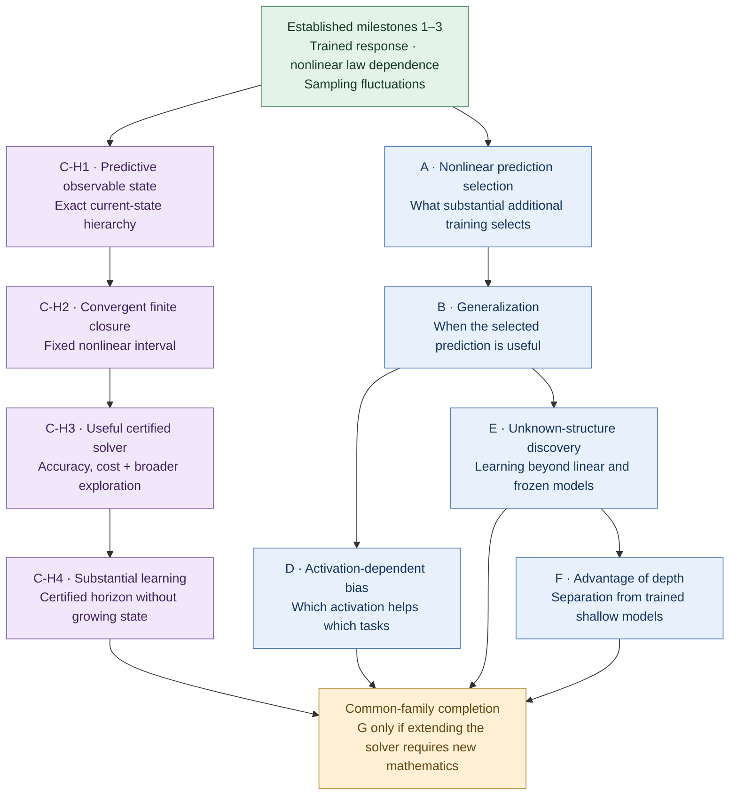

# C-H2 frozen complete guides

Read each included guide in full. This packet preserves source text at the
C-H2 assembly stage. Source boundaries are explicit.

---

Source: `AGENTS.md`

# PDE: shared task instructions

PDE and PDE-2 use this same `/home/amir/Codes/PDE` checkout and Git index.
Do not clone, move or copy it, create parallel worktrees, or reset others' work.

Before acting, select the appropriate reading scope:

- **Research:** read Part 1 of `RESEARCH_WORKFLOW.md` and your study's README.
  Read complete relevant sources and corrections within the study boundary below.
  Read `docs/README.md` and `docs/NOTATION.md` for scientific work, and
  `code/README.md` when using or changing maintained APIs.
- **Promotion:** also read Part 2 of `RESEARCH_WORKFLOW.md` completely.
- **Repository maintenance:** read the workflow and use only the assigned shared
  paths; keep working artifacts in the relevant maintenance study.
- **Scoped research subagent:** follow the supervisor's explicit input scope;
  it may be prompt-only or selected book/code material. This replaces ordinary
  author startup reading, including the study README. Required skills and process
  instructions still apply; report missing scientific inputs without fetching them.
- **Independent isolated review:** read only the neutral assignment, complete
  frozen inputs and required skills. Do not perform author startup or read
  study history, prior verdicts or another reviewer's findings. Report missing
  inputs; write only the assigned report and study-owned scratch.
- **Read-only questions:** read only the assigned sources needed for the answer;
  this is not permission to browse other studies.

Each study's repository research inputs are its own artifacts and generated data,
and the established `docs/` and `code/` with their designated reproduction inputs.
Do not read or search other studies, or obtain their research through links,
chats, summaries, Git history, or other agents. Shared instructions, required
skills, and metadata-only coordination remain available. See Part 1 for scoped
delegation; independent attempts start fresh without inherited discussion.

Studies organize research directions; tasks organize conversations and work.
One task may coordinate several studies through separate research contexts;
several tasks may share a study. Unpromoted findings do not cross study boundaries.
Keep each study's source and evidence in its flat `studies/<name>/` folder and
its generated products in `data/generated/<name>/`. Its existing README is the
only required administrative record; additional ledgers and the helper are optional.

Keep internally checked results distinct from established material. Promotion
requires relevance screening, fresh complete independent reviews, self-contained
canonical theory/reusable code, and user approval of the concrete reviewed addition.
The workflow specifies the checks; an internal PASS or helper result cannot replace them.

Preserve concurrent changes and coordinate one Git writer using the common lock
in the workflow. Existing tasks must reread changed instructions before substantive
work. These files guide all tasks in this checkout; they are not OS confinement.

---

Source: `RESEARCH_WORKFLOW.md`

# Research studies and promotion

This shared guide applies to PDE and PDE-2 in the same checkout. Root `AGENTS.md`
is the automatic entry point. Read Part 1 for research; read Part 2 as well when
proposing promotion. A read-only question needs only its relevant sources.
Studies remain flat: one folder per research direction, with no task-count limit.
A task may coordinate several studies through separate research contexts;
several tasks may share one. Study boundaries also apply to read-only research.

## Part 1: conduct and internally check a study

### Start and keep one useful record

Check current HEAD, index and status before edits; preserve concurrent work.
Use the assigned study, or identify its folder from names/ownership metadata;
do not browse other studies to recover a research state. Reuse the appropriate
folder rather than creating one for every task or lemma. Do not move old studies
or rewrite their history.
Keep each study's research source, proofs, configurations, tests and review reports
in `studies/<name>/`; generated arrays, figures, logs, caches and scratch belong
in its own `data/generated/<name>/<run>/`. Agree on file ownership when tasks share
a study; this does not by itself make their research attempts independent.

Use the study's existing **README.md** as its current record. Update it at meaningful
checkpoints with the question and model/scope, results and evidence links, check
status and gaps, reproduction instructions, contributors/write assignments and
next authorized action. Link to substantial proofs, code and original reports;
do not duplicate them in the README. One task edits shared current notes at a time.
No separate STATE, CLAIMS, EXPERIMENTS, STUDY.json or per-study AGENTS is required.
Keep existing useful records and link them; do not migrate or delete them merely
to adopt this routine. The optional `studies/_workflow.py` supports the older
structured packet format; its extra records/checks are not prerequisites for research.

### Study boundaries and scoped delegation

A study may use its own source/evidence and generated namespace, the established
`docs/` and `code/`, and their designated reproduction inputs. Other studies are
not research inputs, even if linked, apparently relevant, or internally checked.
Do not retrieve their contents through searches, chats, session logs, Git history,
copied summaries, or another agent. Required instructions/skills and metadata-only
checks for directory selection, file ownership and Git safety remain available.
External scientific sources remain subject to the proof requirements below.
A task coordinating several studies keeps their research in separate contexts;
unpromoted findings may not be passed between them. Missing dependencies are
reported, not silently imported from another study.

Before delegation, the supervisor chooses the scientific context suited to the
question, creativity and needed rigor: a self-contained prompt alone, specified
book sections/code, or the relevant permitted study material. State the allowed
inputs and output paths in the assignment. For independent attempts or creative
work with restricted inputs, start a fresh agent without inherited conversation
(`fork_turns="none"` when available); supply only that assignment and its allowed
inputs. Narrow scope replaces routine author README/guide reading, not required
skills or process instructions. Prompt-only means no additional scientific
retrieval. Scoped agents report missing inputs before the supervisor supplies
anything further within the study boundary.

Independent routes in the same study use separate flat files and output namespaces
and do not see each other's approaches or verdicts until their candidates are
frozen for comparison. Record input scope in the assignment and actual sources
in the result; no extra ledger is required. Disclose accidental exposure and use
a fresh context for a blind attempt. The supervisor checks scoped findings against
the complete relevant established sources before accepting them. Promotion reviewers
still receive complete frozen candidates and dependencies under Part 2; creative
scoping does not relax that gate.

### Check results before calling them internally checked

Preserve the objective of nonlinear, nonlazy deep feature learning on correlated
data. State the actual architecture, activation/regularity, initialization/readout,
loss, metric, feature/physical clock, GF/GD scaling, data, depth, observable/norm,
time horizon, convergence mode and limit order relevant to each result. Record
constants' dependence and admissible information for approximation claims.
Comparisons and partial results must keep their exact scope.

Use `solve-math-rigorously` for proof work and `investigate-conjectures` for research
state/conjectures; read their applicable instructions and required references.
If unavailable, report that limitation and retain these explicit rigor requirements.
Read complete sources and corrections within the permitted scope. For specialized
external theorems, inspect statements, proofs and heavy dependencies and verify
hypotheses, or import the needed proof. An inaccessible dependency or unmet
hypothesis remains a gap.

Before marking a result **internally checked**, retain:

- Its precise statement, assumptions and claim type: exact/proved, conditional,
  formal, empirical or open. Claim type is separate from check and promotion status.
- A complete persisted argument or implementation/method, with necessary dependencies.
  Check nontrivial steps and edge cases; for code use meaningful deterministic tests
  and independent oracles where available, including the upstream producer.
- The actual check: who performed it, source version/hash, method/command, observed
  outcome and limitations, with links to full evidence and any unresolved objections.
- For empirical claims, an executed reproduction of the claimed result from the
  recorded inputs, generation and analysis code, in a fresh run directory. Check
  the declared tolerances; reading an old array or redrawing a plot is insufficient.

Internal checking may be performed within the study; independent help is useful
when warranted but is not automatically the promotion audit. Missing checks,
failed reproduction or unresolved correctness objections mean partial/unchecked,
not internally checked. A conditionally proved result may pass for its stated
conditions while the stronger claim stays open. Changed relevant sources or
assumptions require new checks; the old evidence remains attached to its old version.

Retain useful checked results even if weak, remote from the core program or never
promoted. There is **no promotion-relevance gate for storing study results**.
Record adverse evidence and failed routes too. Keep check status and promotion
status separate in the README; an internally checked result is not established.

### Make experiments and figures reproducible

Run only authorized experiments within their budgets; ordinary deterministic
verification of authorized code is allowed. Before a research experiment, record
its purpose, controls, metrics, success/failure/inconclusive criteria, seed/replication
rule and resource/stopping limits. The workflow itself authorizes no training campaign.

Use a fresh run directory and explicit output/cache paths; never overwrite earlier
runs or consumed inputs. Preserve source/configuration in the study, and record
input provenance and hashes, exact command/working directory, source version plus
hashes of dirty used files, environment/dependency versions, seeds, precision and
hardware/thread settings when material. Record exit status, actual outcome, output
paths/hashes and the commands producing tables/figures. Failed or interrupted runs
stay labelled as such. Reproducibility requires retained inputs or a durable way to
obtain them; unavailable inputs are a recorded limitation, not a reproducibility claim.
Generated products stay outside new Git commits, under `data/`; no unique proof,
source, hand-written configuration or essential dependency may exist only there.

At a handoff or close, update the README with checked results, real gaps, evidence
locations and remaining authorized work. No promotion attempt is required. Do not
reopen a closed research campaign from an old next-step note.

### Shared writes

Authors edit only their assigned study artifacts and generated namespaces. Shared
book/code edits are promotion or explicitly authorized maintenance work. Everyone
shares one Git index: designate one writer, use explicit paths, and never clear
or adopt another task's staged work. For each short stage/verify/commit transaction,
take a nonblocking `flock` on `$(git rev-parse --git-common-dir)/pde-writer.lock`,
recheck HEAD/index and file versions, stage only owned paths and verify the staged
list. Release afterwards; do not unlink the lock or hold it during research/tests.
Coordinate if busy or inaccessible; arrange access for the shared lock only,
without changing others' files. Record unreadable inherited files as metadata-only.

## Part 2: promote selected results to the established book and code

Promotion is a separate, stronger review of a specific addition. Internal checks
and their reputation are not substitutes. Prepare everything in the originating
study; reviewers' temporary workspaces belong in its generated-data namespace.
These are scientific requirements, not a requirement for particular JSON forms.

1. **Independent relevance and placement.** A selector who did not author or assemble
   the result compares it with current book/code coverage. Record distinct value,
   useful scope, duplication, assumptions, maintenance cost and the smallest suitable
   destination. Accept for assembly, merge, narrow, hold for a named gap, or decline.
   Exact identities, useful conditional results and scoped obstructions can qualify
   without solving global dynamics. Reject vacuous/oracle assumptions, invalid
   arguments and additions too weak or remote to justify inclusion; retain the
   study result and specific reason. Do not launch new research to rescue a promotion.

2. **Complete candidate.** Draft the actual proposed chapter/module changes in
   canonical notation, preferably extending existing material. Include complete
   proofs, explicit scopes, all necessary dependencies and their proofs, full code,
   meaningful tests and API examples. Supply the notation contract and required
   guides in full. Code must have a compact reusable API with conventions, supported
   ranges and numerical limitations; separate library methods from campaign drivers.
   Maintained material must work without studies, chats, temporary files, historical
   verdicts or archived arrays. Empirical additions need maintained generation and
   analysis commands, inputs/configurations and a reproduction recipe.

3. **Two fresh complete adversarial reviews.** Freeze the complete candidate and
   dependency inputs; retain the exact neutral assignment, file hashes and all
   author/assembler identities. Use two fresh isolated reviewers, distinct from
   every author/assembler and the selector, with no inherited project history,
   internal verdicts or each other's findings. Give only the assignment, full inputs
   and required skills; keep inputs unchanged and scratch separate. Missing inputs
   must be reported and supplied in a new complete packet.

   Both reviewers read every scientific line, including proof/dependency bodies,
   implementation, tests and recipes; repair truncated reads. Test boundary cases,
   constants, hypotheses, information flow, numerical semantics and limit operations.
   Do not promote compactness to uniqueness, formal jets to trajectories, fitting
   to population results, fixed/growing-cap comparisons to cap removal, GF to GD,
   supplied covariance to neural law, or diagnostics to the actual nonlinear model.
   Both audit applicable code and empirical claims, including the producer.

   Save both original full reports with exact read coverage, input hashes, actual
   attacks/commands/results, component verdicts, unresolved objections, isolation
   and completion evidence. The coordinator reads them completely and verifies
   provenance. Any required correction blocks acceptance: preserve the old packet
   and adverse reports, then obtain two fresh complete reviews of corrected inputs.
   Completed reviews can be reused after interruption only with complete evidence
   and identical inputs. A passing helper or claimed reviewer identity proves neither
   honest reading, independence nor correctness.

4. **Validate the proposed edition.** Assemble the final draft with full dependencies
   in a standalone workspace. Test it without studies/history/retained outputs:
   run relevant deterministic tests, guide examples, imports, links and fragments.
   Independently reproduce empirical conclusions through maintained producer and
   analysis commands into fresh `data/established/<run>/` within that workspace.
   Record exact inputs, environment, commands, outputs and limitations; unavailable
   reproduction blocks that empirical addition, not a separately complete proof.

   A separate fresh independent integration reviewer checks the complete new
   assembled material, interfaces, notation, summaries, placement, duplication and
   preservation, without prior verdicts or project history. State the precise older
   read scope and unread complement; this is not a fresh whole-book proof audit.
   Fix objections and obtain a fresh complete review of the corrected integration
   scope. Scientific changes also reopen the paired review gate.

5. **User approval.** Present the concrete final addition and destinations, scientific
   value, exact scope/limitations, review and reproduction outcomes, and your
   recommendation. Obtain and retain the user's approval for that reviewed package
   before changing established book/code. General authorization to research, prepare
   a proposal or commit study work is not promotion approval. Do not ask again for
   an unchanged package already explicitly approved. Approval does not repair a
   failed scientific gate; without both, retain the candidate in the study.

6. **Integrate and check correspondence.** After approval, recheck current dependencies
   and concurrent changes, apply the accepted edition, and verify the actual live
   files against the reviewed draft. Run affected integration checks and retain the
   candidate-to-final mapping, final hashes and commit. Changed scientific content
   or dependencies require renewed reviews and approval for the revised proposal;
   do not silently expand an approved scope. Update the study README with the exact
   incorporated scope and evidence links, or specific exclusions/gaps. Keep original
   reports and hashes as review evidence; no extra administrative ledger is required.

---

Source: `docs/README.md`

# Established theory: a reading guide

This is a modular mathematical library, not a chronological research diary.
Start with [shared notation](NOTATION.md); each chapter then states its exact
model, hypotheses, claim and proof. A local theorem, a special-data theorem and
a benchmark for a different architecture are not interchangeable.

## The scientific question

The project concerns two related mysteries. The first is training: how a deep
network follows an organized learning trajectory through a highly nonconvex
parameter space. The second is more demanding: why the representations selected
by that trajectory can be useful on examples that did not participate in
training. A theory of successful optimization is an important starting point,
but it does not answer the second question. This book presently develops tools
and exact-capture results for the first, while keeping the second as the reason
for studying the internal dynamics rather than only the training loss. The scoped generalization and comparison results below address parts of that second question; broader task-class and architectural conclusions remain open.

Can a deep, genuinely nonlinear network with learned hidden features be
understood as an approximation of an autonomous, uniquely restartable
population evolution? The desired comparison is joint in width and the actual
gradient-descent step, uniform on each finite physical-time interval, and
includes internal representations and the two directions of reused matrices,
not just predictions.

The limiting object should simplify the description without deleting the
mechanism under investigation. A finite number of function or operator fields
can organize an infinite-dimensional state. It need not collapse to finitely
many scalar moments. Its forward and adjoint actions must remember that the
same matrices are used repeatedly in forward propagation, backpropagation and
training. After reuse, a new matrix output contains a response determined by
previous uses together with unexplored Gaussian randomness; declaring it an
independent fresh Gaussian would remove part of the learning dynamics.

Width and time perform different roles in this approximation. Finite width
provides random empirical populations and matrix actions, not necessarily a
spatial grid. Raw GD is a time discretization in the actual trainable
parameters. A width theorem for every separately fixed number of updates does
not supply estimates uniform in the growing number of updates needed when
the step tends to zero. Conversely, a finite-width continuous flow alone says
nothing about the existence or uniqueness of its population limit. A joint
theorem must connect these approximations with an explicit step condition,
topology, mode of convergence and observable contract.

The resulting equations should support restart from their stated admissible
states, with uniqueness there. A convergent endpoint of an already existing
path does not by itself construct or identify the subsequent path. Nor is a
candidate self-consistency equation a convergence theorem. These obligations
are part of exact capture, not optional refinements after finding attractive
formal equations.

### What the theory must preserve

The intended dense-network question retains correlated data, ordinary Gaussian
initialization, nonlinear activations and genuine hidden learning. Freezing
features, imposing orthogonality or whitening, or changing the architecture to
make a proof easy would answer a different question. Explicitly separated
linear and residual-particle benchmarks are useful comparisons, not substitutes.

This is a mechanism-preservation requirement, not a list of forbidden tricks
whose omissions invite equivalent replacements. The population/GF regime is
useful because finite networks can be compared with it. Normalizing input
lengths leaves their angles and correlations available to the theory. By
contrast, forcing all samples to be orthogonal, discarding the Gaussian matrix
bulk, or prescribing a special low-rank initialization can remove precisely the
interactions the main question seeks to explain. Such models may still be
valuable benchmarks if their different role is explicit.

Nonlinearity must be checked on the distributions actually visited, not only
in the written activation formula. Hidden learning requires motion of the
relevant representations at the claimed scale, not merely a nonzero activation
derivative or moving readout. A nonzero initial acceleration, positive gate
mass, persistent feature velocity and a lower bound on relative nonlinear
strength are distinct properties. A fixed-depth theorem with nonzero absolute
nonaffinity need not retain a uniform relative nonlinear contribution as depth
or an activation gain changes. The chapters state these distinctions instead
of treating all activity certificates as equivalent.

Smoothness and boundedness assumptions can define useful sufficient classes;
their role should be exposed in the estimates. Failure of an estimate for one
activation is not evidence that the whole learning regime is impossible.
Likewise, allowing constants to depend on a fixed correlated dataset is not
the same as proving uniformity over nearly coincident samples. Identical inputs
with incompatible labels obstruct exact interpolation by a deterministic
predictor, but do not obstruct defining its dynamics. Noisy data also require
a suitable achievable-risk target rather than an assumption that all noise
can be removed.

### Approximation through a prescribed training accuracy

Capturing the path and proving that it fits are separate tasks. Energy
dissipation alone gives a nonincreasing loss; it does not exclude a positive
limiting loss. A fitting argument needs additional control along training,
for example in the actual residual direction. Initial conditioning by itself
does not supply that control at later times.

Once compact-time loss approximation and population fitting are both proved
for the same model, they combine without interchanging an infinite training
time and the width limit. To make this precise, let `mathcal L(t)` be the
deterministic population loss and let `mathcal L_(n,eta_n)(t)` denote the loss
of the interpolated raw-GD network, under the chapter's admissible joint
scaling. Suppose the latter converges in probability uniformly on every fixed
finite interval and `mathcal L(t)` tends to zero. For any `epsilon>0`, choose
one finite `T_epsilon` with `mathcal L(T_epsilon)<=epsilon/2`. Then

\[
\mathbb P\{\mathcal L_{n,\eta_n}(T_\varepsilon)>\varepsilon\}
\le
\mathbb P\left\{\sup_{0\le t\le T_\varepsilon}
|\mathcal L_{n,\eta_n}(t)-\mathcal L(t)|>\varepsilon/2\right\}
\longrightarrow0.
\]

The inclusion of events proves the assertion directly. It gives high-probability
accuracy at a prescribed finite time and path approximation up to that time,
provided the theorem includes the corresponding path observables. The same
argument applies to finite-width GF when its approximation is proved, or to
an attainable positive loss benchmark with the inequalities shifted by that
benchmark. It does not give one width sufficient for every accuracy, an
arbitrary growing-horizon bound, exact zero loss in finite time, or convergence
of final parameter endpoints. Quantitative width and step requirements require
quantitative approximation estimates in addition to this argument.

### Beyond fixed depth and a fixed dataset

Two further population questions should remain visible. A continuous-depth
description would organize representations across layers, typically with an
explicit residual scaling. An input-population description would replace a
fixed training list by a sampling distribution. Neither follows by simply
renaming an index in a fixed-depth, fixed-batch theorem. They require estimates
uniform in the new parameter, a specified architecture and sampling model, and
control of the interaction between the limits. Sequential width/depth limits
at initialization do not establish joint trained width/depth/time convergence.
The continuous-depth chapter therefore identifies its different architecture
before stating its positive result.

The bridge toward generalization begins with the learned map on passive test
inputs: inputs evaluated by the trained weights but absent from the updates.
One can then ask what the trajectory selects among predictors that fit the
training data, and whether that selection helps for a specified distribution.
Transport, variational or action-based descriptions are possible research
tools, not established explanations here. A generic energy identity or a
unique evolution has explanatory force for generalization only after an
additional argument connects the selected representations to out-of-sample
risk. Finite training correlations and successful transfer-panel experiments
alone would not establish that connection.

## Strategic roadmap: insight before breadth

This section records research objectives and the reasoning behind their order.
It is a plan, not an additional theorem or a claim that its later steps will
succeed. The established statements and their exact scopes remain in the
chapters listed below. Milestone letters A–F and the C-H1–C-H4 hierarchy
packages are planning labels, distinct from the numbered chapter sections.

The intended destination is a coherent explanation of what deep nonlinear
training learns, why its predictions generalize, when depth and activation
help, and how the same population evolution can be computed independently.
The learning, comparison and computational conclusions must eventually apply
to substantially overlapping task families. Separate favorable examples for
different models would not establish this combined objective.

### Why these milestones are separated

The strategic choice is to isolate a tractable part of a hard problem that
still exposes an important learning mechanism. A fixed depth, a structured
family of correlated data, or one finite learning episode can support a deep
insight without simultaneously resolving arbitrary depth, arbitrary laws and
all-time dynamics. The restrictions must preserve the mechanism: ordinary
Gaussian initialization, actual matrix reuse, nonlinear activations and
learned hidden features. Freezing the feature dynamics or imposing a special
initialization that supplies the desired representation would change the
question rather than make progress on this route.

Each milestone should settle one substantial scientific obligation and remain
valuable if the next one fails. The count follows from these obligations;
proof lemmas, additional examples and routine integration are not automatically
new milestones. Successful results also change the next problem: a proof can
expose a better state space, a sharper task family or a simpler argument.
Recalibration after a completed milestone is therefore part of the design.

Breadth is postponed when it adds major technical cost without changing the
explanation. Universal fitting, a generic global Lyapunov construction,
arbitrary growing-horizon finite-width control and joint continuous-depth
limits are not prerequisites for this campaign. They remain possible subjects
of later concerted work, guided by a demonstrated mechanism. Their omission
here is not evidence of impossibility. Conversely, an extension is worth
prioritizing when it is needed to reveal a new mechanism: varying dimension or
task complexity can be essential to a meaningful depth or sample-efficiency
separation. The aim is neither maximal generality nor an isolated toy witness.

This postponement does not permit assuming away a milestone's decisive gap.
If a learning conclusion requires a tail bound, conditioning estimate or
continuation theorem, that obligation must be proved for the admitted family.
Conditional progress can be retained, but it does not complete the stronger
target. Restrictions and unresolved dependencies should remain visible.

### Established starting point and dependency map

In *Global nonlinear learning*, C.4.5 supplies the fitted two-hidden-layer
tanh reference and its whole-circle endpoint. The first three milestones
are established at the following scopes: C.4.6 captures actual finite-GF data
derivatives at that reference on every separately fixed horizon and gives
uniformly bounded population homogeneous propagation; C.4.7 constructs nearby
nonlinear changed-law flows through physical time 40 and a finite-contamination
remainder; C.4.8 supplies the actual influence field, Hilbert sampling limit
and mean-square remainder at time 40, with a width-first finite-GF bridge.
These statements retain the full Gaussian action and actual adjoint. They do
not by themselves prove broad useful generalization, architectural superiority
or an efficient independent numerical representation.



The arrows express the intended mathematical dependencies, not implications
already proved. The same dependency map is recorded in the table for readers
whose renderer does not display Mermaid diagrams. C-H3 can inform the other
directions empirically without being a prerequisite for their initial proofs.

| Milestone | Starting dependency | Scientific result sought |
|---|---|---|
| A | Established 1–3 | Nonlinear selection of the whole-input prediction |
| B | A and the established sampling calculus | Useful generalization of that selection |
| C-H1 | Established 1–3 and the exact population equations | A sufficient current observable state with exact evolution identities |
| C-H2 | C-H1 | One convergent finite autonomous closure on a fixed nonlinear interval |
| C-H3 | C-H2; prototype during C-H2 | A useful certified solver and controlled broader exploration |
| C-H4 | C-H3 and the established learning-horizon bounds | Certified substantial training with no accumulating state |
| D | B | An explanation of activation-dependent bias |
| E | B | Efficient discovery of unknown structure |
| F | E | A genuine advantage over trained shallow models |
| Common-family completion; G only if needed | C-H4, D, E and F | Compatible conclusions and computation at the learning scales |

### A. Nonlinear prediction selection after substantial learning

Determine the whole-input prediction selected after finite, nonvanishing
adaptation to additional data, starting from the original initialization and
actual training law. A representative setting is
\(\mu_{\varepsilon,\nu}=(1-\varepsilon)\nu_*+\varepsilon\nu\), where
\(\nu_*=\tfrac12\delta_{(\sqrt2e_1,+1)}+
\tfrac12\delta_{(\sqrt2e_2,-1)}\) and \(\nu\) ranges over a nontrivial
family on \(\sqrt2S^1\times[-Y,Y]\), with fixed \(Y\ge1\).
Here \(e_1,e_2\) are the input coordinate unit vectors. Inputs outside the
reference pair need not be orthogonal.

The target is a determining characterization with controlled whole-circle
error and additional hidden adaptation. Write \(f_*^\infty\) for the fitted
reference prediction and \(P_\nu\) for the selected prediction. Seek a fixed
improvement \(R_\nu(f_*^\infty)-R_\nu(P_\nu)\ge a>0\), where
\(R_\nu(f)=\int(f(x)-y)^2\,d\nu(x,y)\). The margin must survive
the small-contamination and width limits on a specified robust subfamily;
it cannot disappear merely because the component has weight \(\varepsilon\).
Measure additional hidden motion against the matched reference evolution or
its justified hidden endpoint, rather than against initialization alone.
The original finite Gaussian readout, both orientations of the reused middle
action, and the exact model and training metric are retained. Population
continuation and actual finite-GF capture must be justified through the chosen
learning horizon, with explicit limit order.

One finite adaptation episode can suffice. A first derivative, formal jet,
restatement of the original parameter equations or small mixture loss alone
does not determine the requested nonlinear selection. The fitted endpoint,
response geometry and source estimates provide a concrete starting point;
control of accumulated adaptation remains the new obligation. This yields an
independent explanation of substantial nonlinear learning even if B fails.

### B. Generalization of the selected predictor

For a task family defined independently of the network's eventual answer,
connect the selected whole-input prediction to the regression target. Derive
population approximation error, sampling and noise control, and a justified
training horizon or stopping rule. The guarantee should improve with available
information or computational effort in a stated regime; finite-network
transfer must keep its proved scope.

The sampling limit in C.4.8 describes fluctuations around the population
predictor. It does not establish that this predictor is close to the desired
target, nor does its prediction-variance formula automatically identify excess
risk. A supplies the selection mechanism to analyze; B supplies the connection
to useful unseen predictions. This is valuable without an architectural
superiority theorem.

Section C.4.10 supplies B at a finite-episode scope for a declared full-circle regression family. Its approximation floor and unevaluated conditioning constants leave arbitrary-accuracy learning and practical computation as further questions.

### C. Independent computation and broader empirical exploration

Construct a fundamentally different finite causal system approximating the
same population GF, with one physical time, explicit initialization and
prediction reconstruction. The certified target includes enough internal
observations to identify the evolution and support its claimed restartability,
including the effects of both Gaussian action directions and their reuse.
An autonomous ODE, PDE or integro-differential hierarchy is admissible; a fitted
surrogate or replay of the target trajectory is not. The current route replaces
the single C package by the four hierarchy milestones below. Its finite state
consists of current observable populations and their required joint statistics,
including differentiated fields where justified. At a chosen order, state size
stays fixed during the run; elapsed steps cannot add history slots. The chosen
order may depend on the requested accuracy and declared horizon.

Account for total storage, computation, precision, quadrature, field count and
memory cost. A collection of low-dimensional fields can qualify. A hidden
high-dimensional density, unevaluated Gaussian-action oracle or renamed
trainable fully connected matrix does not establish manageable computation.
The completed route should cover an explicitly represented family of laws,
including nonatomic examples, through the established learning horizon, with
useful accuracy within a concrete resource bound. Earlier milestones isolate
information sufficiency, convergence and numerical usefulness so each is a
substantial result even if the later horizon extension fails.

**C-H1: a predictively sufficient current observable hierarchy.** Give an
explicit nested dictionary, its exact finite-order evolution and initialization,
and its typed joint-law or mixed-statistic state. Prove that equal complete
hierarchy states at admissible reached restarts determine equal subsequent
whole-circle predictions and the declared internal/action observations under
the same training law. Preserve both directions of matrix reuse; a list of
formal initialization derivatives is insufficient. Bounded determining tests
may replace raw moments when moment determinacy is unavailable. This package
does not require a closed finite truncation or a numerical efficiency theorem.

Section C.4.7.8 establishes this information milestone for the canonical
two-hidden-layer tanh model on a fixed positive law neighborhood and physical
interval `[0,1/200]`. Its finite-alphabet joint populations have exact weak
evolution through a finite higher level and an explicit cutoff limit within
that level. Equal complete hierarchies at a reached state give equal future
whole-circle predictions and the declared joint observations, including for
matching realizations on another carrier. Finite closure convergence and
effective evaluation of the cutoff limit remain open.

**C-H2: one convergent finite autonomous closure.** Construct actual finite
equations initialized from the canonical model, and prove their convergence in
prediction and internal observations on a fixed positive nonlinear interval
and a fixed nontrivial correlated-law family. Neither may shrink with order.
Highest-order equations may be modified, provided their effects are controlled.
Develop a small prototype during this work. Fixed-order bounds, compatible
joint laws, compactness and identification may provide a route to convergence
without a single all-order weighted norm; realizability and identification of
the limiting dynamics must be proved. A conditional estimate assuming a small
omitted tail does not complete this milestone.

**C-H3: useful certified computation.** Make that same closure independently
computable, with separate control of hierarchy, population/input quadrature,
time-integration and arithmetic errors. Evaluate resource and conditioning
bounds and resolve a predetermined prediction change and hidden-learning
signal within the proved regime. Verify restart using only the saved current
state. Count the required joint correlations, not merely separate marginal
populations. The equations should also admit broader exploratory use without
fitting to a known population trajectory.

**C-H4: substantial learning without accumulating state.** Extend the same
solver and its certified useful accuracy through the established physical
time 40 on a fixed supported family, retaining prediction and paired internal
observations. Carry errors across every continuation interval; do not import
exact intermediate states or grow the history. Accumulated-training-force
estimates are a possible analysis tool, with their control-tube hypotheses
preserved; they are not a source of prescribed reference forcing for the
solver. If C-H3 already proves this horizon, merge these two packages. A shorter
certified interval alone does not complete C-H4.

The strategic separation is between information, truncation, useful cost and
continuation. C-H2 carries the principal unresolved theoretical risk. Existing
fixed-order Gaussian-source derivatives are not temporal-jet tail estimates.
The Stieltjes representation disproved in *Gaussian and flow calculus*,
Sections 7.2 and 10.2, is not a premise of this route. Rational or Padé-type
closures remain options requiring their own justification. The same chapter's
Section 6 excludes certain unrestricted same-norm algebra/jet estimates, and
Section 10.4 excludes its specified Taylor closure; neither supplies a general
impossibility theorem for current observable hierarchies. No particular closure,
tail estimate or success of the later computation milestones is asserted here.

The second purpose is reliable empirical investigation beyond conservative
proof bounds. Make the construction reusable wherever its equations and
approximations remain meaningful, to investigate larger law perturbations,
broader input correlations, longer training and the resulting whole-input
predictions and risks. Such observations may reveal that a theorem's small
admissible neighborhood reflects its estimates rather than actual failure of
learning. This is a hypothesis to test, not a conclusion supplied by the plan.

Outside the certified regime, label results exploratory. Check refinement of
time discretization, resolution and truncation, relevant numerical errors,
and agreement with independently simulated finite networks as width increases
under stated step conditions. Finite networks already provide a simulation
route; C supplies an independent approximation to help separate population
behavior from finite-width and numerical effects. A stable-looking curve at
one resolution is insufficient. Broader empirical evidence does not prove
existence, convergence or generalization theorems, and changed depth or
architecture may require different equations. Experiments retain their own
authorization, reproducibility and review requirements.

### D. Activation-dependent inductive bias

Explain which task characteristics favor one activation over another through
the actual trained selection mechanism. Seek two genuinely different
activations and robust regimes with a meaningful crossover, including sampling
sensitivity where relevant. Initial kernel spectra can guide a proof but do
not replace analysis of trained nonlinear predictions.

Control initialization and output scales, training time and tuning opportunities.
Avoid manufacturing the comparison through scalar gain alone or a symmetry
mismatch that prevents one model from representing the task. Each activation
requires its own justified dynamical scope. B makes the comparison interpretable
in terms of task structure and risk. A successful D explains activation choice
even if efficient unknown-structure discovery remains open.

### E. Efficient discovery of unknown structure

Show how useful representations emerge without being supplied in the
initialization. On a substantial structured task family with unknown directions,
components or interactions, prove discovery and exploitation by the actual
jointly trained network, with explicit sample, training-time and finite-network
requirements. Finite GD claims retain their proved step conditions.

Establish class-level advantages over deep linear training and precisely
specified frozen-feature and initialized tangent-kernel alternatives. The
advantage may concern sample, parameter or computational scaling; it need not
exclude approximation by a much more expensive competitor. State resource
constraints and tuning opportunities fairly. A and B explain selection and
its usefulness; emergence from the original Gaussian initialization is E's
additional obligation. Response around a fitted reference alone does not
establish it.

### F. A genuine advantage of depth

Find a robust task class for which the actual deep training algorithm has a
learning guarantee that a trained one-hidden-layer alternative cannot match
under clearly stated resource or training constraints. Combine the deep upper
bound with an appropriate shallow approximation, statistical or optimization
lower bound. The explanation must identify useful nonlinear composition across
layers. Feature motion, sequential discovery or superiority over a frozen
kernel alone does not establish the shallow comparison.

E supplies actual discovery of unknown structure; F identifies structures for
which depth makes its exploitation substantially more efficient. A suitable
common task family and the required exact-model shallow obstruction remain
research obligations, not assumptions secured by the roadmap.

### Common-family completion and the possible milestone G

The final learning, activation, depth and computational results must have
substantial overlap in task families, models and learning regimes. C's solver
must cover the relevant horizons with error smaller than the claimed learning
and comparison margins. If C's approximation and complexity theorem already
provides this, completion is integration and verification. If extending it
requires new mathematics, that is a separate milestone G; its count is not
fixed in advance for presentation symmetry.

A possible missing obligation is controlling the necessary source modes or
memory using the learned structure. Low-dimensional structure in a target
does not automatically imply a small representation of the trained Gaussian
evolution. This computational compatibility and the exact-model shallow
separation are substantial uncertainties. Screen candidate families early
for compatibility rather than accumulating results that cannot be combined.

### Conditional GD fallback and recalibration

The current route uses the established GF foundation. Reconsider direct GD
when a milestone encounters a persistent, precisely identified obstacle that
a discrete formulation might remove. A failed calculation or one unsuccessful
proof route is not evidence against the target itself.

First distinguish a route failure, a missing estimate and an obstruction to
the claim. Then compare concrete GF and GD formulations with the same learning
objective, initialization, nonlinear mechanism and observations. Tensor-program
identification makes each admissible fixed GD computation available in the
width limit; the number of steps may be large and depend on the dataset or
desired accuracy if chosen before width. It does not itself prove that those
steps achieve useful loss, hidden adaptation or generalization. A discrete
route can therefore avoid continuous-time existence while retaining a hard
long-training problem. The exact clocks and endpoint geometry already
available for GF are reasons to assess the particular obstacle before switching.

Adopt a GD route only when this comparison identifies a documented, concrete
advantage in addressing the named obstacle while preserving the stated target,
or explicitly agreeing a revised target. Availability of tensor-program limits
alone is insufficient reason for a switch.

A fixed-step GD result must be stated as such: its learning-rate-dependent
prediction is not automatically the GF prediction. If a branch adopts GD,
common-family completion with C requires a proved dynamics comparison,
controlled discretization bias or a separately formulated computational theorem
for GD. Numerically discretizing GF is also distinct from changing the learning
algorithm to fixed-step GD.

Recalibrate after successes as well as persistent blockages, using the actual
proved statements and dependencies. The intended order is A, then B, followed
by D and E, with F after E; C can proceed independently from the established
starting point. Each claimed win retains independent scientific review and
the existing promotion requirements. The roadmap does not authorize importing
unreviewed findings across study boundaries or treating exploratory evidence
as established theory.

## Chapters and their exact roles

| Chapter | Established content and scope |
|---|---|
| [Finite dynamics and energy](finite_dynamics.md) | Exact all-depth, finite-batch gradients, raw kernel blocks and dissipation; global finite-width GF for `C^2` activations; finite-horizon norm bounds under bounded slopes. Separate L2 one-sample QI/IQ/QQ and differentiated RMS identities include full gradients/kernels, Lax operators, an orientation witness and balance laws. Separate half-square-loss, order-one-readout results give a frozen quadratic joint initial layer, a reached finite ReLU classical obstruction, and local compactness of actual ReLU Euler outputs. |
| [Gaussian and flow calculus](gaussian_calculus.md) | Exact conditioning, empirical transpose laws, rational Gaussian moments and fixed-program width identification with order-one stored readout. Also finite moving physical-flow jets at arbitrary fixed depth/batch through order five, typed held-fixed preactivation Hessians, exact weighted contraction trees and Gaussian forests with all-moment concentration, polynomial Gaussian fourth-order heads, simultaneous fixed-program quadratic loss-GD closure, a width-first quadratic initial layer, exact shallow identity GD and positive Stieltjes measure, a regenerated frozen-first-block Stieltjes certificate, and exact-compiler cubic step-doubling coefficients with explicit fifth-order remainders for fixed depth/update count. Finite loss-GD pullback words and a separate convex-region comparison bound retain the moving residual. An explicit forest proof extends the Stieltjes witness to an existential interval of positive metrics; canonical factorial growth rules out uniform convergence of a prescribed Taylor-loss family. These annealed formal results remain distinct from positive-time network convergence. A sharp shallow feature-step bound is uniform in update count, with a restricted dyadic expected-output limit. No growing reused-matrix program or physical-loss GF inference. An identity-only theorem at every separately fixed depth proves an explicit update-uniform fifth-order remainder and local operator-state flow after the fixed-program width limit; its separate deterministic energy-ball witness refutes a proposed activation-stability bound. A separate exact three-query law proves failure of uniform higher-moment bounds, conditional on a common action realization for the corresponding operator conclusion. Exact integrated-query perturbation and adaptive transcript results include a contained matrix-concentration proof, causal filtering, own-history rank bounds, and same-cap comparison for R_n=o(log n). They do not remove caps or supply a common varying-cap population limit. |
| [Arctangent operator limits](arctan_limits.md) | One input and label one, small stored readout: global joint L=2 limit and complete local L=3 limit, with their own step conditions and observable contracts. Also contains a global auxiliary population/width theorem at each fixed backward-query cap, on finite feature-time horizons. This is not the uncut optimizer. |
| [Global nonlinear learning](global_nonlinear.md) | The same activation `1+arctan(z)/10`, every separately fixed hidden depth `L>=3`, one input and label one: global compact-time joint limit, fitting, persistent nonaffinity and hidden activity. Broad two-layer activation-transform limits allow orthogonal data, with an affine-first arbitrary-data exception and distinct GD step conditions. A separate fixed-depth C1,1 theorem is local for arbitrary fixed data and subGaussian roots; its strict-activity corollary keeps extra Gaussian and nondegeneracy hypotheses. A separate local two-hidden-tanh theorem admits every bounded-label law on the normalized input circle: quantitative training-law and replacement stability, a precisely ordered expected generalization-gap bound, simultaneous sampling/width/raw-GD consistency without relative growth restrictions, and an open nonlazy family. A separate fitted-reference transfer gives whole-circle endpoint approximation and risk at most 1/4 at T=40 for an explicit, extremely small binary-law neighborhood, with early paired hidden activity; it does not construct global perturbed-law population dynamics. At that fitted reference, a separate response theorem captures actual finite-GF data derivatives on each fixed horizon and the whole circle, with uniformly bounded population homogeneous propagation and total-variation forcing control. [Section C.4.7](global_nonlinear.md#c47-nonlinear-training-near-the-fitted-tanh-reference) separately constructs nonlinear changed-law population flows in a sufficiently small neighborhood of that reference through physical time 40, captures actual finite GF there, and gives a finite-contamination remainder with a width-first bridge to the response. [Section C.4.8](global_nonlinear.md#c48-sampling-fluctuations-of-the-trained-prediction) gives the actual centered influence and an L2(circle) Gaussian sampling limit at T=40 for every separately fixed Borel law in a smaller neighborhood, with spatial covariance, a mean-square remainder and a width-first finite-GF bridge. [Section C.4.9](global_nonlinear.md#c49-nonlinear-prediction-selection-during-a-finite-added-data-episode) characterizes a finite nonlinear added-data episode for an open single-atom family admitting nonorthogonal inputs: original fixed-mixture GF selects a constrained whole-circle prediction at physical times of order 1/epsilon, with positive added-atom risk improvement, paired second-hidden adaptation and width-first finite-GF capture. It does not assert a final changed-law endpoint or an out-of-sample risk guarantee. [Section C.4.10](global_nonlinear.md#c410-generalization-during-a-finite-added-data-episode) gives finite-episode generalization for an independently specified odd Fourier regression family with full-circle input densities and bounded centered noise. It combines finite-mode nonlinear approximation, separate input/noise sampling bounds and a class-determined positive stop, with robust unseen-risk improvement, paired circle-plus-anchor second-hidden motion, and ordered width/contamination/sample limits for actual GF; conditioning constants remain unevaluated. [Section C.5](global_nonlinear.md#c5-early-test-risk-advantage-over-frozen-features-at-matched-training-loss) separately proves a small early-time test-risk advantage over frozen initial hidden features at matched training loss for one prescribed three-point tanh design and the uniform-circle target `cos(3 alpha)`. Its computer-assisted positive cubic coefficient has a controlled actual-flow remainder; neither the time interval nor the remainder constant is numerically evaluated. The frozen population kernel equals the full initial tangent kernel under this initialization; the finite comparator freezes hidden layers and trains only the readout. This is no class-level or later-time superiority theorem. |
| [Population limits and correlated-data geometry](special_data_limits.md) | Opposite-label L2 arctangent at orthogonal/antipodal inputs; equal-label shifted-arctangent L3 at all admitted correlations; and a three-sample bounded-shape/gain family at every fixed depth. A separate generic-correlation L2 arctangent theorem proves strong first-layer GF/raw-GD compactness and no kinetic defect, not a unique population limit. Initialization comparisons separately prove sharp odd-mixture conditioning, convex-offset collapse despite scalar nonaffinity, and calibrated sequential width/depth geometry. Separate plateau proofs give a protected Gram, continuous-time row confinement, selected conditional path-law compactness, and finite fitting/restart obstructions. A near-identity family has conditional necessary fitting-distance and time bounds. Further complete global families include separated two-sample offset activations, the odd delta-squared scale and its normalization variants, general-shape and every-fixed-depth perturbations with their own cutoffs, and a three-sample odd large-gain theorem. Moderate sine has exact initialization, a local limit, finite controls and conditional continuation. Further sections contain order-one Gaussian-readout L2 natural-gate GF limits, equal-label sech-gate L3 transfer, order-one-readout tanh short-time/zero-label results, unit-mobility sin-plus-cosine formal coefficients, global given-space affine references with qualified fitting, conditional Osgood continuation, and same-array response estimates. Reached local sech-gradient irregularity, ambient metric/response obstructions and the separate auxiliary first-Euler obstruction retain their distinct scopes. |
| [Linear dynamics and exact-capture comparisons](linear_dynamics.md) | Existing L3 one-input operator/GF/GD theorem, fitting and restricted nonclosure; plus shallow nonlinear characteristics with compact-time output/loss error rates and bounded-activation particle coupling, a contained L2 linear spectral GF system with fitting, and the operator GF limit at every separately fixed linear depth, including trace-norm increment control. These added one-input, order-one-readout GF theorems have no raw-GD or arbitrary-data extension. |
| [Continuous depth](continuous_depth.md) | A different, scalar-particle residual architecture: global characteristic GF and joint width/depth convergence under explicit parameter regularity. A separate section derives finite dense-ResNet gradient/energy/response identities and supplied-trajectory factorial tails, retaining the actual matrices and a separate source-error term. A coherent dense `W/n` kernel model also has a complete global strong-carrier flow with fixed endpoints. A distinct finite-source conditional transport model has complete adjoint, variational, kernel, energy and parity identities, with its regularity and uniqueness premises explicit. These dense and finite-source results supply no width/depth approximation or joint GD-step theorem. |
| [Finite optimization and controls](finite_optimization_and_controls.md) | Canonical L=3 arctangent finite GF and exact GD fitting with finite endpoints on proved Gaussian events; a separate energy-compatible finite projection, integrated L1 defect and exactness at a sufficient cap C sqrt(n). Also mixed-activation L2 finite-GF fitting at every interior correlation with opposite labels, and permanent first-gate mass on an augmented event. A separate prescribed-Hilbert-space capped flow has conditional exponential-tail continuation; its Gaussian action construction and finite-network identification are not supplied. Exact integrated-query memories and supplied-path time covers are also included, with causal stability and derivative/kernel gaps explicit. Full finite tangent geometry adds intrinsic-volume control and its Gaussian expectation, an exact hidden-projection factor, and a deterministic reachable signed-Hessian obstruction. Further squared-log response bounds, a complete reused-Gaussian initialization law and actual small-time positive-curvature estimates have their own finite scopes. Moderate sine has raw-GD energy bounds, weak path tightness and strong endpoints conditional on an existing population path. No population/GD extension for the projection or mixed-activation results. |

Read the first two chapters as common mathematical foundations. The nonlinear
chapters carry their complete source-identification and stability proofs; a
reader need not reconstruct a probability argument from an earlier report.
The linear and continuous-depth chapters clarify what an operator representation
can retain and which conclusions are architecture-dependent. The finite-controls
chapter separates optimization from population identification. The accompanying
[implementation guide](../code/README.md) describes the finite reference, moving
jets, quadratic/RMS state evaluators, a frozen-quadratic half-loss step, and exact Gaussian/certificate/Euler
arithmetic. Section C.5 additionally includes a computer-assisted sign proof: its analytic error bounds and executed finite arithmetic jointly establish the coefficient enclosure. The optional certificate tool regenerates its inputs and exact intervals from source, with independent checking routes and no archived-array dependency.

## Comparison of mathematical targets

Several distinct targets are often conflated:

- A fixed finite Gaussian computation identifies finitely many matrix calls;
  it does not automatically control a growing number of GD steps.
- A formal self-consistency equation identifies a candidate; its well-posedness
  and convergence from actual networks are additional obligations.
- A fixed-kernel approximation does not establish learned hidden features.
- A finite number of function or operator fields is not a finite number of
  scalar moments. Restricted nonclosure can coexist with an operator limit.
- Compact-time convergence and optimization are separate. If population loss
  tends to zero, choose a finite `T` for a desired loss accuracy first; uniform
  approximation on `[0,T]` then transfers that accuracy to sufficiently wide
  networks with sufficiently small steps. This does not give a bound uniform
  over arbitrary growing `T_n` or convergence of final parameter endpoints.

These are distinctions between mathematical claims, not an assertion that an
entire literature lacks a particular theorem or that the library establishes
priority over all prior work. No such novelty claim is needed by any proof here.

The same care applies to the value of intermediate results. Exact finite
identities, Gaussian-response calculus, correct computational recurrences,
initialization bounds and scoped representation obstructions are substantive
results even when they do not deliver a global nonlinear limit. An auxiliary
clipped flow can isolate the estimate that is missing for the uncut system.
However, a comparison for caps increasing with width does not alone construct
one common population limit. An obstruction to a specified scalar encoding
does not forbid an operator representation. These distinctions guide what is
worth proving and incorporating, not merely how finished theorems are named.

## Orientation to prior work

The following primary sources provide non-exhaustive context, not theorem
dependencies of the chapters. Their hypotheses are not imported to complete
any proof in this library. The useful comparison is between precise models and
limits, rather than labels such as “mean field,” “DMFT” or “deep.”

Yang and Hu's *Tensor Programs IV* studies infinite-width feature-learning
parameterizations and gives discrete-training limit formulas. It is directly
relevant to retaining nonlinear hidden learning under matrix reuse. A
fixed-program identification result must still be supplemented by estimates
uniform in a refining time mesh to obtain the particular joint GF target here;
this is an additional obligation, not a claim that tensor-program methods
cannot contribute to optimization theory.
[Tensor Programs IV](https://proceedings.mlr.press/v139/yang21c/yang21c.pdf).

Rigorous nonlinear multilayer mean-field theory is not absent from the
literature. Nguyen and Pham develop a neuronal-embedding framework with
trajectory approximation and optimization results in specified setups; their
all-depth optimization conclusions include special correlated initializations.
Comparing such a result with this book requires matching the hidden-sum
normalization, initial laws, training metric and surviving Gaussian actions,
not merely counting hidden layers or observing that both limits are nonlinear.
[A Rigorous Framework for the Mean Field Limit of Multilayer Neural Networks](https://arxiv.org/pdf/2001.11443v3).

Nor is every DMFT result only a formal physics calculation. Celentano, Cheng
and Montanari prove bounded-time high-dimensional trajectory limits described
by DMFT for a class of random-design flows. Their applications include shallow
networks with a fixed number of hidden units while input and sample dimensions
grow. This is a rigorous, relevant comparison, but a different limit from
training all hidden Gaussian matrices at diverging width and fixed input data.
[The high-dimensional asymptotics of first order methods with random data](https://web.stanford.edu/~chen96/papers/fom_dynamics.pdf).

For particle/measure descriptions, Chizat and Bach connect a many-particle
gradient flow to optimization under explicit structural and initialization
conditions, including single-hidden-layer applications. This is a useful
precedent for combining approximation and fitting; the logical strategy is
not itself a novelty claim. Extending exact capture to nested learned matrix
actions requires additional structure beyond a shallow particle description.
[On the Global Convergence of Gradient Descent for Over-parameterized Models using Optimal Transport](https://arxiv.org/pdf/1805.09545v2).

Linear and kernel descriptions remain informative comparisons, but neither
alone explains nonlinear feature learning. Conversely, a nonlinear population
equation does not by itself prove optimization or generalization. A serious
comparison records architecture, initialization, data model, parameterization,
optimizer, horizon, topology and observable scope side by side. This book
makes no comprehensive literature-exclusion or priority claim.

## Scope and future development

The global uncut dense L=3 arctangent population theorem for general correlated
datasets is not asserted. The local two-hidden-tanh result in
[Global nonlinear learning, Section C.4](global_nonlinear.md#c4-training-law-stability-for-two-hidden-tanh-layers)
proves a local input-population limit and bounds the absolute value of the expected
train–test gap, with the time supremum outside the expectation. Its local theorem
does not bound the expected absolute gap or excess risk. Section C.4.5 separately
proves useful-risk reduction and whole-circle robustness at a fixed time near
one fitted opposite-label reference. Its certified neighborhood is extraordinarily
small; it supplies neither a global perturbed-law population flow nor evidence
that feature learning outperforms frozen or linear models. Section C.4.6
separately captures actual finite-GF data derivatives at this trained reference
on each fixed horizon, with a population homogeneous propagator bounded
uniformly in time. Its total-variation forcing bound gives response control
linear in the horizon; C.4.6 itself constructs neither nonlinear changed-law
population flows nor a finite-contamination remainder. Section
[C.4.7](global_nonlinear.md#c47-nonlinear-training-near-the-fitted-tanh-reference)
separately constructs nonlinear changed-law population flows in a sufficiently
small neighborhood of that fitted reference through physical time 40, captures
actual finite GF on this interval, and gives a finite-contamination remainder
with a width-first bridge to the infinitesimal response. Its nonlinear claims
have the stated neighborhood and fixed horizon. Section C.4.8 gives the actual centered influence and an L2(circle) Gaussian sampling limit at T=40 for every separately fixed Borel law in a smaller neighborhood, with spatial covariance, a mean-square remainder and a width-first finite-GF bridge.
[Section C.4.9](global_nonlinear.md#c49-nonlinear-prediction-selection-during-a-finite-added-data-episode) characterizes a finite nonlinear added-data episode for an open single-atom family admitting nonorthogonal inputs: original fixed-mixture GF selects a constrained whole-circle prediction at physical times of order 1/epsilon, with positive added-atom risk improvement, paired second-hidden adaptation and width-first finite-GF capture. It does not assert a final changed-law endpoint or an out-of-sample risk guarantee. [Section C.4.10](global_nonlinear.md#c410-generalization-during-a-finite-added-data-episode) gives finite-episode generalization for an independently specified odd Fourier regression family with full-circle input densities and bounded centered noise. It combines finite-mode nonlinear approximation, separate input/noise sampling bounds and a class-determined positive stop, with robust unseen-risk improvement, paired circle-plus-anchor second-hidden motion, and ordered width/contamination/sample limits for actual GF; conditioning constants remain unevaluated.
[Section C.5](global_nonlinear.md#c5-early-test-risk-advantage-over-frozen-features-at-matched-training-loss) separately proves a small early-time test-risk advantage over frozen initial hidden features at matched training loss for one prescribed three-point tanh design and the uniform-circle target `cos(3 alpha)`. Its computer-assisted positive cubic coefficient has a controlled actual-flow remainder; neither the time interval nor the remainder constant is numerically evaluated. The frozen population kernel equals the full initial tangent kernel under this initialization; the finite comparator freezes hidden layers and trains only the readout. This is no class-level or later-time superiority theorem.
A global input-population theorem and a dense Gaussian joint depth/width/time
theorem remain outside the established scope; this is not an impossibility result.

Future additions should enlarge this library through proved statements with
explicit dependencies and consistent notation. Each result should say which
inputs, initialization, mobilities, observables, topology and horizons it covers;
whether learning remains nonlinear and nonlazy; and exactly what restartability
means. Numerical evidence requires its full generation commands, configurations
and seeds. No theorem relies on an empirical figure or an unreproducible coefficient table. C.5 explicitly includes its computer-assisted certificate, complete analytic error bounds, and maintained reproduction source.

---

Source: `docs/NOTATION.md`

# Shared notation and model conventions

This file is the notation contract for the established library. A chapter may
introduce a typed auxiliary variable, but must not silently change these
conventions. A theorem's stated initialization, loss and learning rates override
no other theorem: different models are explicitly distinguished.

## Network, data and layers

`L` counts hidden layers, `m` samples, `d` input coordinates and `n` hidden width.
These quantities are fixed separately unless a theorem explicitly takes their
limit. Samples are `(x_a,y_a)`, with `x_a` in `R^d` and scalar label `y_a`.
The input Gram is `G_ab = x_a^T x_b/d`; normalized inputs have `G_aa=1`.
No diagonalization, whitening, orthogonality or nonsingularity is implicit.

The finite first matrix has shape `n` by `d`, the hidden matrices have shape
`n` by `n`, and the stored readout is a vector of length `n`:

\[
z_a^{(1)}=W^{(1)}x_a/\sqrt d,\qquad
z_a^{(\ell)}=W^{(\ell)}h_a^{(\ell-1)}\quad(2\le\ell\le L),
\qquad h_a^{(\ell)}=\phi^{(\ell)}(z_a^{(\ell)}),\qquad
f_{n,a}=\frac{(W^{(L+1)})^T h_a^{(L)}}n.
\]

For the one-input datum `x=1`, `d=1`, the first preactivation and first weight
vector coincide. A common activation is written `phi`; layer-dependent
activations retain their layer superscripts. Write activation derivatives
explicitly as `phi'` rather than introducing a second name for the derivative.

The residual is always `r_a=f_a-y_a`. It is not part of the backpropagated
derivative. In a finite network define

\[
\delta_a^{(L)}=W^{(L+1)}\odot(\phi^{(L)})'(z_a^{(L)}),\qquad
\delta_a^{(\ell)}=(\phi^{(\ell)})'(z_a^{(\ell)})\odot
(W^{(\ell+1)})^T\delta_a^{(\ell+1)}.
\]

Thus `delta_a^(ell)=n partial f_(n,a)/partial z_a^(ell)`. The main squared-loss
convention is `mathcal L_n = m^{-1} sum_a r_(n,a)^2`. Sum or half-sum losses
must be stated where used and change physical time by the corresponding factor.

## Populations, operators and norms

Finite hidden coordinates are lower-case `z^(ell), h^(ell)`; population
coordinates are capitalized `Z^(ell), H^(ell)`. Every hidden layer has its own
probability space `Omega_ell` and expectation `E_ell`. An expectation contracts
only objects in the same population. Population weight operators and the
population readout retain the layer-indexed symbol `W^(ell)`; their operator or
random-variable types are stated explicitly. Population backward coordinates
may be written `Delta^(ell)`; plain `Delta` without a layer is a proof mesh.

Finite transpose is `T`; a population Hilbert-space adjoint is `*`. These are
the actual two directions of the same operator, not independent random maps.
Initial Gaussian population actions can be bounded without being Hilbert–Schmidt;
the trained increments may belong to a smaller operator class.

Use ordinary finite Euclidean, Frobenius and operator norms. A finite RMS is
`||v||_2/sqrt(n)` and a finite normalized pairing is `u^T v/n`; do not hide
these factors in new norm or inner-product symbols. A population norm is
`||U||_(L^p(Omega_ell))=(E_ell |U|^p)^(1/p)`. Typed abstract Hilbert spaces in
the linear or operator constructions use ordinary Hilbert norms and pairings.

The population rank-one operator `U tensor V` means
`g -> U E[V g]`; its finite coordinate representative is `u v^T/n`.
The Wasserstein distances between laws are written `mathcal W_p`, with the
underlying Euclidean or path metric stated; they are not weight matrices.

## Initialization and clocks

The nonlinear small-readout convention has independent first weights
`N(0,1)`, hidden-matrix entries `N(0,1/n)`, and **stored** readout entries
`N(0,1/n^2)`. Its limiting initial readout is zero. A chapter using order-one
stored readout states that different initialization explicitly. Equal limiting
initial predictions do not identify the two regimes.

`t` is physical training time, `eta_n` the actual GD step and `Delta` an
auxiliary proof discretization. `kappa_ell` denotes a fixed positive mobility
multiplier. For the preceding first-weight convention the block mobilities are
`n kappa_1, kappa_2,...,kappa_L,n kappa_(L+1)`. Raw GD updates the weights,
which are linearly interpolated; hidden quantities are then recomputed.

For one sample, unit mobilities and label one, feature time obeys
`ds/dt=2(1-f)=-2r` on an interval where this is positive. It is not a new
optimizer. The arctangent coordinate change `F(z)=z+z^3/3` is exact for the
continuous flow only. For `phi(z)=1+arctan(z)/10`, the corresponding primitive
is `F(z)=10(z+z^3/3)`. Neither turns exact raw GD into exact transformed Euler.

## Scope of a limit statement

Every result specifies the physical horizon, mode and topology of convergence,
step condition, observables and restart domain. Compact-time means each fixed
finite `[0,T]`, not one bound valid for all time or for an arbitrary growing
sequence `T_n`. A local theorem remains local. Loss decay, population existence,
finite-width approximation, nonaffinity and hidden feature motion are separate
claims. A fixed finite number of operator or function fields is not a
finite-dimensional scalar state.

---

Source: `code/README.md`

# Finite dynamics, moving jets and exact calculus

This NumPy-only package implements the finite equal-width network in
[the notation contract](../docs/NOTATION.md) and
[the finite-dynamics chapter](../docs/finite_dynamics.md).
It supports any positive number of hidden layers and any nonempty fixed batch.
It is a finite reference implementation; numerical tests do not establish an
infinite-width limit. Separate small modules provide exact rational Gaussian
moments, a two-hidden-layer one-sample physical-flow jet through order three,
colored-forest keys, finite rational certificates and Euler pullback weights.
A separate module evaluates finite quadratic/identity and differentiated RMS
models. Their narrower contracts
are stated below; they are not a general symbolic population compiler.

## Model and normalization

Inputs `X` have shape `(d,m)` with samples in columns. `Parameters.weights`
contains `W1,...,WL`: shapes `(n,d)`, then `(n,n)` for every hidden matrix.
`Parameters.readout` has shape `(n,)`. The equations are

```text
z1 = W1 @ X / sqrt(d)
zl = Wl @ h(l-1)              for l >= 2
hl = activation_l(zl)
f  = readout @ hL / n
loss = mean((f - labels)**2)
```

There is no additional `1/sqrt(n)` in the hidden forward passes: hidden
weights are already stored in the scaled convention. Initialization draws
independent Gaussian first weights with variance `1`, hidden entries with
variance `1/n`, and stored readout entries with variance `1/n²`. Draw order
is first matrix, hidden matrices in layer order, then readout. Every call
requires an explicit seed and leaves the global random generator unchanged.

`X.T @ X / d` is the input Gram. Samples with unit RMS have unit Gram diagonal,
but the implementation also accepts arbitrary finite inputs, including zero,
correlated, duplicated, opposite and linearly dependent samples. It never
whitens, rescales or inverts their Gram. Unequal hidden widths are rejected.

## API

`forward` returns per-layer preactivations, hidden activations and the output.
`backward` returns the residual-free arrays
`delta_l = n * partial f / partial z_l`. `loss_gradients` returns ordinary
Euclidean/Frobenius mean-squared-loss gradients in the `Parameters` structure.

`flow_velocity` returns `-D grad(loss)`, with block mobilities
`n*kappa_1, kappa_2,...,kappa_L, n*kappa_(L+1)`. Supply `kappas` as a length
`L+1` positive vector; the default is all ones. `gd_step` adds `eta` times
that velocity to every block simultaneously using the original state. It
returns new arrays, leaving the original parameters unchanged. It is an exact
GD update, not an exact finite-time flow solution; an arbitrary GD step need
not decrease the loss. No clipping or transformed-coordinate Euler step is used.

`kernel_blocks` returns shape `(L+1,m,m)`, and `kernel` sums those blocks.
Neither includes the residual or the loss factor `2/m`. Along the flow,

```text
f_dot    = -(2/m) * K @ (f-y)
loss_dot = -(4/m²) * (f-y).T @ K @ (f-y)
         = -sum_blocks ||velocity_block||² / mobility_block
```

Activations may be a single `Activation` or one per hidden layer. `TANH`
(default), `ARCTAN` and `IDENTITY` are provided. A custom
`Activation(name, value, derivative)` must return real, finite arrays with
the same shape as its input. It must apply a scalar function coordinatewise,
and supply that function's actual derivative, consistently across calls;
C2 regularity is the caller's responsibility.
Finite shapes, numeric values, block multipliers and step sizes are checked.
Parameters accept array-like input and store float64 arrays; those arrays
remain mutable and may share memory with arrays passed to the constructor.
They are revalidated before evaluation.

Each activation callback receives a private input copy, and its returned array
is copied before reuse. In-place callbacks and reusable output buffers are
supported; callbacks must not mutate unrelated external state used by the
calculation. Built-in derivatives avoid cancellation in saturated tanh and
premature overflow in arctangent. Loss evaluation uses a scaled mean square.
Unrepresentable losses and total kernels raise `ValueError`. This is still
float64 arithmetic: it does not promise correct rounding or immunity from
intermediate overflow or underflow in arbitrary matrix products.
Scalar/elementwise mobility and kernel factors are combined in mantissa/exponent
form before restoring their magnitude. GD likewise combines the step with the
gradient directly; it need not construct a representable unscaled velocity.
Flow and GD use raw derivative contractions, without requiring a separately
representable normalized `loss_gradients` result. Gram normalization is likewise
combined with the block multipliers. First-layer input normalization follows
the raw matrix product. The raw contractions themselves remain float64 operations.
A zero step validates parameter and argument structure and returns independent
copies without evaluating unused activation callbacks.

## Example

Run Python with `code/` on its import path:

```python
import numpy as np
from pde import ARCTAN, forward, gd_step, initialize, kernel, loss

X = np.sqrt(2.0) * np.array([[1.0, 0.6, -1.0], [0.0, 0.8, 0.0]])
y = np.array([1.0, -0.5, -1.0])
theta = initialize(width=8, depth=3, input_dimension=2, seed=42)
print(forward(theta, X, ARCTAN).output)
print(kernel(theta, X, ARCTAN))
next_theta = gd_step(theta, X, y, eta=0.01, activation=ARCTAN)
print(loss(theta, X, y, ARCTAN), loss(next_theta, X, y, ARCTAN))
```

The library and example write no files. Matrix storage grows as
`n*d + (L-1)*n² + n`; forward/backward states use `O(L*n*m)` memory, and the
kernel blocks additionally use `O((L+1)*m²)`.

## Tests

From the repository root, using Python 3.10+ and NumPy:

```sh
PYTHONPATH=code PYTHONDONTWRITEBYTECODE=1 OPENBLAS_NUM_THREADS=1 OMP_NUM_THREADS=1 python -B -m unittest discover -s code/tests -p 'test_*.py' -v
```

The tests use depths 1, 2 and 3, general finite states and tiny seeded
initializations, correlated/opposite/conflicting labels, and layer-dependent
activations. Every raw parameter block is checked against coordinate finite
differences of the loss; independent output-Jacobian differences verify each
kernel block. Directional differences check flow dissipation, and a hand
calculation checks simultaneous GD. Shape/domain validation, batch invariance,
zero residuals, initialization scaling and input normalization are covered.
The suite uses NumPy and Python's standard `unittest` only, with no experiments
or generated-data dependencies.

## Exact Gaussian moments

`gaussian_moment(covariance, powers)` returns a `fractions.Fraction` equal to
`E[prod_i X_i**powers[i]]` for a centered Gaussian vector. Covariance must be
a nonempty, square, symmetric positive-semidefinite matrix with integer or
`Fraction` entries. Powers must be nonnegative integers of matching length.
Use finite lists or tuples; floats and booleans are rejected. Singular and
zero covariance are accepted. No rounding or PSD tolerance is used.

```python
from fractions import Fraction
from pde import gaussian_moment

sigma = [[2, Fraction(1, 3)], [Fraction(1, 3), 3]]
assert gaussian_moment(sigma, [2, 2]) == Fraction(56, 9)
assert gaussian_moment([[1, 1], [1, 1]], [2, 2]) == 3
```

Validation uses exact rational Schur complements. A positive pivot reduces
to its Schur complement; a zero pivot requires a zero corresponding row.
The moment recurrence removes one leg, pairs it with each remaining coordinate
with its multiplicity and covariance factor, and recurses. Odd total degree
returns zero; all zero powers return one, after validation. Its cache is local
to a call and is cleared on return, including when evaluation raises.

Validation costs `O(d³)` rational operations. The recurrence visits at most
`prod_i(powers[i]+1)` exponent states, with `O(d)` transitions per state and
depth at most `1 + sum(powers)/2`. Both state count and rational bit sizes can
grow rapidly; this API is intended for small exact moments. It performs no
numerical quadrature and claims no population-limit theorem. The module uses
only the standard library; the public `pde` package also imports the NumPy
finite-network API.

Moment tests check known uni-/bi-/trivariate formulas, negative correlations,
independent coordinates, singular/zero covariances, exact near-boundary PSD
rejection, input types/shapes/degrees, and absence of input mutation or shared
cross-call caches.

## Moving physical-flow jets

`from pde.finite_jets import flow_jet` supplies a bounded derivative oracle
for exactly two hidden layers and one sample. It takes an existing finite
`Parameters` state, `(d,1)` inputs, one label, positive block multipliers,
and one shared C3 activation's derivative callback. It supports ordinary
Taylor coefficients through order three, at any supplied state. No Gaussian
initialization or population replacement is performed.

```python
import numpy as np
from pde import Parameters
from pde.finite_jets import flow_jet

theta = Parameters(([[0.2]], [[0.3]]), [0.4])
def derivative(j, z):
    return (0.4 + np.sin(z), np.cos(z), -np.sin(z), -np.cos(z))[j]

jet = flow_jet(theta, [[1.0]], [1.0], derivative, order=3)
print(jet.output_coefficients[:, 0])  # f^(k)(0)/k!
print(jet.output_derivatives[:, 0])   # physical-time derivatives
```

Every weight block, the reused transpose, and the residual move in this
recurrence. Its coefficients are not obtained by evaluating along the straight
line defined by the initial gradient, or by multiplying feature-time derivatives
by powers of an initial residual clock. The calculus chapter gives the complete
recurrence and physical-clock chain rule.

`parameter_coefficients[k]` uses the existing raw storage. Each of the two
`preactivation_coefficients` and `hidden_coefficients` arrays has shape
`(order+1,n,1)`; tuple positions zero and one denote hidden layers one and two.
`output_coefficients` and its factorial conversion have shape `(order+1,1)`.
Only derivative orders zero through the requested order are evaluated, at
initial preactivations. The unused terminal backward derivative is not computed.
Order zero evaluates only the predictor, after validating the arguments.

The callback receives a private array and must return the true coordinatewise
derivative of the same scalar activation, with the same shape and real finite
values. Its result is copied immediately. In-place callbacks and reusable
buffers are supported; semantic consistency and C3 regularity are caller
obligations. Returned arrays are mutable but do not alias the user's inputs.
The existing numerical range contract applies. In particular this is float64
evaluation of an exact real-arithmetic recurrence, not exact arithmetic or a
certified rounding bound. Nonfinite evaluated coefficients and nonrepresentable
requested derivative conversions are rejected. Intermediate products may still
overflow or underflow. For degree at most three, work and storage are
`O(n*d+n²)`, apart from callback costs.

Tests include hand-solvable linear, cubic and constant-activation flows;
independent derivative checks against the existing physical RHS; neuron
relabeling; callback ownership; zero residual/input; degree prefixes; and
selected numerical-range failures. These are finite deterministic checks,
not an infinite-width identification or positive-time Taylor error theorem.

## Forest keys and exact finite certificates

Import `forest_key`, `revert_series`, `determinant`, and
`quadratic_axis_certificate` from `pde.exact_calculus`. These operations draw
no random numbers and write no files.

`forest_key(colors, edges)` accepts a finite simple bipartite forest. A vertex
color is `(layer, decoration)`, where the layer is one or two and the decoration
is a nonnegative integer. Edges join vertices from different layers. The
immutable result preserves colors and component multiplicities while ignoring
vertex numbering, edge orientation and edge ordering. Duplicates, cycles and
invalid indices are rejected. The calculus chapter proves the key's exact
isomorphism property and, separately, the leading Gaussian expectation
factorization that motivates component reuse. The key itself is not a general
coefficient compiler. Its transparent all-roots recursion is intended for small
forests and is subject to Python's recursion limit.

`revert_series(a)` accepts ordinary coefficients of a truncated series with
zero constant and nonzero linear term. It returns the equally truncated inverse
under composition, using only coefficient matching. `determinant(M)` computes
the exact rational determinant of a square matrix, with the empty determinant
equal to one. Their inputs are finite lists or tuples of Python integers or
`fractions.Fraction`; floats and booleans are rejected. Neither mutates its
input. Reversion uses at most `O(N⁴)` rational operations in this transparent
implementation, and elimination uses `O(N³)`. Rational bit sizes can grow.

The fixed certificate can be regenerated from the repository root by:

```sh
PYTHONPATH=code PYTHONDONTWRITEBYTECODE=1 python -B -c 'from pde.exact_calculus import quadratic_axis_certificate; c = quadratic_axis_certificate(); print(c["shifted_determinant"]); print(c["witness_value"])'
```

It prints the two negative rational quantities proved in the calculus chapter.
The function independently regenerates the order-thirteen jet, six coefficients,
and polynomial witness; it does not load historical arrays. The returned fresh
dictionary also contains the derivative list, inverse series and kernel series.
The standard established test command checks every displayed fraction, both
directions of series reversion, and a separate permutation determinant and
polynomial quadratic-form calculation.

The certificate concerns the quadratic network with order-one stored readout,
feature ascent and zero first-block mobility, all explicitly specified in the
proof. It rejects a moment representation demanded uniformly over metrics
including that one. It does not resolve the canonical unit-metric all-order
problem or establish failure of a positive-time population limit. Section 10
separately proves persistence of its witness for some strictly positive first
mobilities, by an explicit forest argument and continuity; this API does not
calculate that interval or positive-metric jets. Its initialization-jet proof is
separate from verification of its exact arithmetic. No training experiment,
historical campaign output, or empirical figure is incorporated by these tests.

## Finite quadratic and RMS reductions

`pde.finite_reductions` evaluates three small, exactly specified finite
models from Sections 5–7 of the finite-dynamics chapter. All calls require
the existing `Parameters` structure with two hidden layers and input
dimension one. The datum is fixed to `x=1`; `label` is a finite real scalar.
The first and readout mobilities are `n`, and the middle mobility is one.
These APIs evaluate a state; they do not integrate a trajectory.

```python
from pde import Parameters
from pde.finite_reductions import mixed_lax, mixed_quadratic, rms_quadratic

theta = Parameters(([[0.5], [1.0]], [[0.2, -0.1], [0.3, 0.4]]), [0.5, -0.2])
mixed = mixed_quadratic(theta, 1.0, model="QI")
lax = mixed_lax(theta, model="QI")
normalized = rms_quadratic(theta, 1.0, epsilon=0.2)
print(mixed.kernel_blocks, normalized.kernel_blocks)
```

`mixed_quadratic` accepts `QI`, `IQ` or `QQ`, naming the first and second
activations in order: `Q(z)=z²`, `I(z)=z`. Its default is `QQ`.
`rms_quadratic` squares and then normalizes each hidden vector by
`sqrt(mean(squared_vector**2)+epsilon)`, with required `epsilon>0`.
Both normalization denominators are differentiated. This widthwise operation
is a separate architecture and cannot be supplied as a scalar `Activation`.
No initialization distribution or readout scaling is imposed by either call.

Both return a `ReductionEvaluation` with `output`, `residual`, `loss`,
`kernel`, and `kernel_blocks` in first/middle/readout order. The three blocks
exclude residual and loss factors. `ascent` is the output metric gradient,
and `velocity` is the physical mean-square-loss velocity `-2*residual*ascent`;
both use raw `Parameters` storage. `output_velocity=-2*residual*kernel` and
`loss_velocity=-4*residual**2*kernel` use that same physical clock.

`fields` contains the current hidden and backward vectors. For mixed models,
its keys are `h,z,v,b,q`, with `h` the first feature, `z` the second
preactivation, `v` the second feature, `b=a` for `QI` and `b=a*z` otherwise,
and `q=B.T@b`; here `B` is the stored middle matrix and `a` the stored
readout. The RMS result additionally includes `p=u²`, `alpha`, `w=z²`,
`beta`, `c=a-output*v`, and `q_tilde=q-h*(h@q/n)`, with `b=2*z*c/beta`.
All vector fields have shape `(n,)`. `field_ascent` gives derivatives of
`h,z,v` in the mixed models, and `p,alpha,h,z,w,beta,v` in the RMS model,
in unit feature ascent. Scalars `alpha,beta` and their derivatives are floats.

For `QQ` and RMS, `row_balance_ascent` and `column_balance_ascent` return
the unit-ascent derivatives of `n*sum_j(B_ij²)-2*a_i²` and
`n*sum_i(B_ij²)-u_j²/2`. Both vanish for `QQ`. RMS has the signed drifts
derived in the chapter; its row drift generally persists at zero
regularization where the denominators are nonzero. The API itself requires
positive regularization. Multiply these returned derivatives by `-2*residual`
for the physical clock. They are `None` for `QI` and `IQ`.

`mixed_lax` accepts only `QI` or `IQ` and returns the ordinary Euclidean
isometric block `factor`, `factor_ascent`, `gram`, `signature`, `operator`,
`generator`, and `ascent`. The operator is `signature @ gram`; its
unit-ascent derivative is the commutator with `generator`. For `IQ` the
generator already includes the factor two. These matrices retain neuron
orientation and have size `n+1`; the API does not evolve spectra alone.

All returned arrays are fresh float64 arrays and inputs are unchanged.
The dataclass fields are fixed, but contained arrays and dictionaries are
mutable. The evaluators reject nonfinite evaluated fields, kernels and
velocities, including unrepresentable required intermediates. Arithmetic
here uses ordinary float64 operations; it has no certified rounding bound
or universal extreme-range guarantee. Underflow can occur. It does not
inherit the core network's specialized scaled-product treatment.
The two state evaluators use `O(n²)` work and storage; the explicit dense
Lax products use `O(n³)` work and `O(n²)` storage.

Tests compare the mixed models with the independent layerwise core,
differentiate every RMS parameter block from the output definition, and
check kernel blocks, feature derivatives, physical energy, the Lax chain
rule, an orientation witness, balance drifts, zero coordinates, sign
invariance and array ownership. No training run or generated dataset is used.

## Exact Euler pullback words

`pde.exact_calculus` also supplies the finite operator weights proved in
Section 9 of the Gaussian/flow-calculus chapter:

```python
from fractions import Fraction
from pde.exact_calculus import euler_pullback_words, paired_euler_weights

assert euler_pullback_words(2, 2) == {(2,): Fraction(2), (1, 1): Fraction(1)}
assert paired_euler_weights(2) == ((Fraction(0), Fraction(-2)),
                                   (Fraction(0), Fraction(1)))
```

`euler_pullback_words(order, steps)` maps each positive composition
`(k1,...,kq)` of the requested degree to `Fraction(binomial(steps,q))`,
omitting zero weights. The tuple denotes `T_k1 ... T_kq` acting from right
to left, where `T_k u = D^k u[v,...,v]/k!`. An outer operator differentiates
the state-dependent vector field in each inner expression. Degree zero
returns the identity word `{(): Fraction(1)}`; positive degree with zero
steps returns `{}`.

`paired_euler_weights(order)` returns `order` immutable rational rows.
Row `q-1` gives the coefficients in increasing powers of the update count
`N` of `binomial(2*N,q)-2**order*binomial(N,q)`. Every row has length
`order`, since its possible highest-degree term cancels. Degree zero
returns `()` and degree one returns `((Fraction(0),),)`.

Inputs must be nonnegative Python integers; booleans, floats and `Fraction`
inputs are rejected. The operations evaluate neither derivatives nor neural
moments. Their output is combinatorial, with no state, data or history input.
Word enumeration uses at most `O(j*2**j)` work and storage at degree `j`;
paired weights use `O(j²)` rational operations and storage. Integer bit
lengths can grow. These are finite exact primitives, with no cache, files
or random sampling. The tests independently enumerate update slots and
compare the assembled differential words with direct nonlinear scalar
Euler composition through degree six.

Fixed-order coefficients alone supply no bound uniform in update count,
no positive-time Taylor convergence and no neural width limit. The chapter
separately proves a finite-dimensional comparison bound under explicit
convex-region hypotheses containing every required intermediate state.

## Frozen-bottom quadratic step

The separate frozen-bottom model in Section 8 of the finite-dynamics chapter
holds the first feature vector `h` fixed and trains only the connector and
stored readout, with mobilities one and `n`. Its top activation is
`z**2/sqrt(3)` and its loss is **half** the squared residual. The two functions
below take the current readout `a`, preactivation `z=B@h`, and fixed second
moment `Q=h@h/n`. No initialization or first-layer update occurs.

```python
from pde.finite_reductions import frozen_quadratic, frozen_quadratic_step

a, z, Q = [0.3, -0.8], [0.4, -0.2], 0.7
state = frozen_quadratic(a, z, Q, label=1.0)
next_a, next_z = frozen_quadratic_step(a, z, Q, eta=0.01, label=1.0)
assert len(next_a) == len(next_z) == 2
assert state.loss == 0.5 * state.residual**2
```

`FrozenQuadraticEvaluation` contains `output`, `residual`, `loss`, the two
`kernel_blocks` in connector/readout order, `output_velocity`, `loss_velocity`,
`readout_velocity`, and `preactivation_velocity`. With `K=sum(kernel_blocks)`,
the half-loss convention gives `output_velocity=-residual*K` and
`loss_velocity=-residual**2*K`. Both increments in `frozen_quadratic_step`
use the old state and the same physical step `eta`; these are exactly the
coordinates induced by simultaneous raw connector/readout GD.

Vectors must be nonempty, finite real numeric vectors of the same length.
`Q` is nonnegative, with `Q=0` requiring `z=0`. Every `Q>0` permits every
finite `z` through a suitable raw connector. `label` is a finite real scalar;
`eta` is finite and nonnegative. Booleans are rejected. Defaults use label one.
All returned arrays are fresh; calls take `O(n)` work and storage. Both
evaluated quantities (including the kernel) and updated coordinates must be
representable in ordinary float64. Underflow and rounding remain possible.

The code supplies a state evaluator and one update, without a step-size
stability guarantee or a population solver. The chapter's initial-layer
theorem separately requires its stated frozen Gaussian initialization and
joint vanishing-step limit. The four tests differentiate the raw unreduced
loss and output, verify both kernel blocks and the half-loss energy identity,
compare the simultaneous raw update and interpolation, and check degenerate
states, input validation and ownership. No training experiment is used.


## General finite jets and typed preactivation curvature

`finite_jets.finite_flow_jets` extends the supplied-state calculation to any
fixed finite depth and batch, through ordinary order five. It uses the same
`Parameters` storage, input factor `1/sqrt(d)`, output factor `1/n`, full mean
squared loss and block mobilities `(n*k1,k2,...,kL,n*kout)` as `finite_network`.
All parameter blocks, residuals and reused transposes move. It draws no
initialization and computes no time trajectory.

```python
import numpy as np
from pde.finite_network import Parameters
from pde.finite_jets import (
    finite_flow_jets, hidden_gram_jet, preactivation_hessians,
    preactivation_hessian_words,
)

state = Parameters((np.array([[0.2], [-0.3]]), np.eye(2)/3),
                   np.array([0.4, -0.1]))
def polynomial_derivative(j, z):
    if j == 0:
        return z + z*z/5
    if j == 1:
        return 1 + 2*z/5
    return np.full_like(z, 2/5 if j == 2 else 0)

activations = (polynomial_derivative,)*2
inputs = np.array([[1.0, -0.5]])
jet = finite_flow_jets(state, inputs, [1.0, -1.0], activations,
                       order=4, kappas=[1.0, 0.7, 1.0])
gram = hidden_gram_jet(jet, 2, kind="activation")
assert jet.clock == "physical_full_mean_loss"
assert gram.shape == (5, 2, 2)
curvature = preactivation_hessians(state, inputs, activations)
words = preactivation_hessian_words([2, 2], affine_flags=[False, False])
assert curvature.hessians[0].shape == (2, 2, 2)
assert len(words) == 2
```

For requested order `q`, each layer callback supplies derivatives `0..q` at
that layer's initial preactivation; for `q=0`, only values are needed.
Consistency with a componentwise `C^(q+1)` activation near the supplied state
is the caller's obligation. Each callback receives a private array and its
returned buffer is copied. Parameters, data, and returned arrays are owned
independently. Nonfinite outputs are rejected; roundoff, underflow and
intermediate overflow limit float64 evaluation.

`FiniteFlowJet` holds parameter coefficients `0..q`, one preactivation and
activation array of shape `(q+1,n,m)` per layer, output coefficients of shape
`(q+1,m)`, and backward coefficients `0..q-1` of shape `(q,n,m)` per layer.
Coefficients are derivatives divided by factorials. The backward arrays have
an empty degree axis at order zero. `hidden_gram_jet` uses a one-based layer
index and explicitly selected `activation` or `preactivation`, and returns
ordinary coefficients of the same-layer matrix `X.T@X/n`.

The curvature evaluator instead returns `n*Hess_(z_l) f` while all downstream
weights and the readout are held fixed. Its local source is
`diag(phi''(z_l)*incoming_backprop)`. The returned backward vectors have
shape `(n,m)` and Hessian/source arrays have shape `(m,n,n)`. It is not the
full parameter Hessian or a material derivative. `preactivation_hessian_words`
allows unequal supplied hidden widths; every factor carries its role, layer,
and matrix shape. An identically affine source may be removed, but its slope
factors in other source terms remain. The numeric evaluator uses the existing
common-width `Parameters` contract and derivatives zero through two.

These bounded computations have polynomial arithmetic cost in the supplied
finite sizes and requested order. Dense Hessians require quadratic storage
in width and dense matrix products. No population covariance, analytic time
series, or fitting claim is inferred from finite coefficients. Deterministic
tests compare raw gradient blocks and second variations, a closed shallow
identity series, the existing two-layer oracle, independently differentiated
downstream polynomials, typed word evaluation, and callback ownership.

## Exact Gaussian forests, polynomial heads and certificates

The additional operations in `exact_calculus` implement the contained
finite-contraction proofs in the Gaussian-calculus chapter. Rational scalar
inputs use Python `int` or `Fraction`; boolean and floating inputs are rejected.
Count inputs use Python integers. The operations neither draw samples nor
load coefficients, run training, retain caches, mutate inputs, or write files.

```python
from fractions import Fraction
from pde.exact_calculus import (
    GaussianForest, forest_expectation, quadratic_forest_derivatives,
    quadratic_euler_pullback, gradient_tree_terms, identity_shallow_step,
    next_hankel_threshold, bernstein_coefficients,
)

root = GaussianForest(((1, 1), (2, 2), (2, 2)), ((0, 1), (0, 2)))
derivatives = quadratic_forest_derivatives(root, 1)
first = sum(weight*forest_expectation(tree)
            for tree, weight in derivatives[1].items())
assert first > 0
pullback = quadratic_euler_pullback(root, Fraction(1, 100), loss=True, label=1)
assert sum(weight for weight, _ in gradient_tree_terms(3).values()) == 6
assert identity_shallow_step(0, 2, 0, 1, 1, Fraction(1, 10)) == (
    Fraction(2, 5), Fraction(52, 25), Fraction(0))
assert next_hankel_threshold([[1, 0], [0, 0]], [2, 0]) == 4
assert bernstein_coefficients([-1, 0, 1], 0, 1) == (-1, -1, 0)
```

`GaussianForest` owns canonical immutable row/column colors `(population,
nonnegative_integer_power)` and simple bipartite acyclic edges, including
isolated vertices and the empty forest. `forest_expectation` returns its exact
normalized Gaussian expectation at a supplied positive `width`, or its
leading value when width is omitted. Normalization is `n^(-edges/2-components)`;
row, column and edge arrays are independent standard Gaussians. Finite-width
evaluation sums all equality partitions. Leading evaluation uses paired
quotient trees, with no binary-rank or zero-prefix pruning.

`quadratic_forest_derivatives` returns a tuple of newly owned forest
polynomials, starting with order zero. It requires even column decorations,
raw square activation, one input, two hidden layers, and feature-ascent
mobilities `(n*alpha,beta,n)` for nonnegative rational `alpha,beta`.
`quadratic_euler_pullback` uses raw squares and unit block multipliers. Its
signed rational step gives one simultaneous feature update, or a full squared
loss update with `loss=True` and an explicit rational label. It retains the
moving residual in that update. Normalized squares with a different activation
constant require the separately stated scaling in the proof.

`gradient_tree_terms(k)` returns canonical parameter-contraction trees with
integer weights and typed-by-edges vertex indices; the weights sum to `k!`.
This constant-metric differentiation compiler is distinct from Gaussian
neuron forests. `identity_shallow_step` gives the exact scalar closure for
one-input shallow identity, full squared loss and equal block mobilities
`n*mobility`, from any feasible supplied `(f,q,d)`.

`gaussian_hidden_head(covariance,responses,activation)` evaluates the explicit
local fourth-order Bell/product graph using an ordinary rational polynomial
activation. Coordinates are `(Z,U1,U2,U3,U4,V0,V1,V2,V3)`. Supply the complete
rational positive semidefinite covariance, `Var(Z)=1`, independent first-five
and last-four blocks, and exactly the response keys `lambda1`, `lambda2`,
`lambda30`, `lambda32`, `lambda41`, `lambda43`, `c10`, `d21`, `d30`, `d32`.
Singular blocks are valid. The returned exact scalars are `gamma`, `A41`,
`A43`, `gram13`, `gram22`, and `squared_rms_fourth`. The last is the fourth
**derivative**, `2*gamma+8*gram13+6*gram22`. Response partials hold every other
coordinate and supplied constant fixed before expectation. The implementation
forms activation derivatives zero through four and expands polynomials;
it offers no nonpolynomial-integral or formal-symbolic mode and supplies no
neural interpretation of input covariances.

`next_hankel_threshold` validates rational positive semidefinite `A`, including
a singular range condition for `b`, and returns the exact lower bound on the
new diagonal entry. `bernstein_coefficients` supports an explicit degree at
least the supplied polynomial degree and exact interval endpoints. Signs
certify that supplied polynomial only. Forest enumeration, polynomial heads,
canonicalization, and Wick recursions may have rapidly growing cost; no
large-order efficiency guarantee is made. Python recursion limits and rational
bit growth still apply. Tests use unrestricted finite index sums, raw updates,
independent polynomial contractions, exact Gaussian quadrature, singular
matrix examples, and rational polynomial identities.

## Certified fixed-model test-risk comparison

The opt-in [two-layer risk certificate tool](tools/two_layer_risk/README.md)
supports the computer-assisted sign proof in
[global-nonlinear C.5](../docs/global_nonlinear.md). It certifies one fixed
coefficient for exactly two tanh hidden layers, the canonical Gaussian
initialization and mobilities, three correlated training inputs, and the
uniform-circle teacher `cos(3 alpha)`. It includes the training-loss clock
subtraction. It is not a training solver or a general-purpose quadrature API.

From the repository root, on the supported arithmetic platform, choose an
output directory that does not already exist:

```sh
python -B code/tools/two_layer_risk/certificate.py --target 26 --output data/established/two_layer_risk_01
```

The tool regenerates every Gaussian-rule input and enclosure, compiles its
private C++ kernel, and saves exact rational bounds and execution provenance.
It requires Python 3.10+, NumPy and the C++17/IEEE arithmetic contract in
its guide; ordinary package imports do not require a compiler. The guide
also supplies an API example and independent exact-arithmetic and supplied-rule
checks. No archived arrays, study files or Git metadata are runtime inputs.

The theorem proves a small strictly positive risk improvement at equal
training loss on a width-independent initial interval. It does not evaluate
that interval numerically, supply a width rate, or assert a universal or
later-time benefit. The complete analytic error proof and finite calculation
are both necessary for the sign; a floating positive estimate is insufficient.
