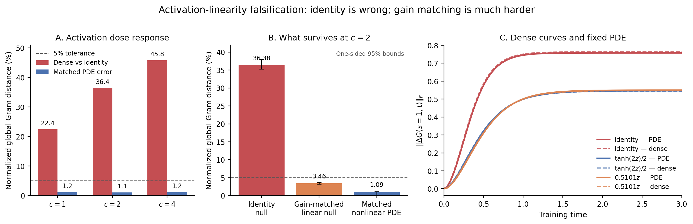

# Activation-linearity falsification test for the fixed-\(P=5\) neural PDE

## Executive verdict

The exact identity/deep-linear explanation is decisively false for the learned
Gram and output curves. In the sole preregistered confirmatory case
\(c=2\), the paired dense-network Gram trajectory is \(36.38\%\) away from
the identity trajectory (one-sided 95% lower bound \(35.27\%\)), whereas the
matched \(P=5\) PDE is only \(1.09\%\) away from the \(c=2\) dense trajectory.
The identity PDE used as a wrong predictor misses that same nonlinear
trajectory by \(35.37\%\). This directly satisfies the proposed comparison

\[
D(\mathrm{dense}_{0},\mathrm{dense}_{2})
>
D(\mathrm{PDE}_{2},\mathrm{dense}_{2})
\]

by a factor of \(33.2\) on the global Gram metric.

That is not the strongest possible conclusion. A non-oracular, gain-matched
deep-linear control

\[
\phi_{\mathrm{L2}}(z)=\kappa_2z,\qquad
\kappa_2=\mathbb E[\operatorname{sech}^2(1.3Z)]
=0.5101185599716273
\]

is only \(3.46\%\) away from the \(c=2\) dense Gram curve, with a 95% interval
bounded by \(3.25\%\) and \(3.67\%\). It is therefore statistically confined
inside the preregistered \(5\%\) tolerance. The nonlinear PDE still has a
resolved advantage: its \(1.09\%\) point error is smaller by a descriptive
factor of \(3.16\), and the one-sided lower bound for
\(D(\mathrm{dense}_{\mathrm{L2}},\mathrm{dense}_{2})
-1.5D(\mathrm{PDE}_{2},\mathrm{dense}_{2})\)
is \(1.79\%\). But the experiment does not justify saying that higher-order
activation effects are necessary to achieve \(5\%\) accuracy in this setup.

The preregistered verdict is therefore **identity-only smoking gun**:

- the PDE is not merely reproducing the exact nonlazy deep-linear network;
- its activation-specific prediction is real and highly resolved;
- nevertheless, a more intelligent fixed-gain linear surrogate remains a
  viable \(5\%\)-level approximation.

This distinction is the strategically important answer. The old reports did
not contain a formal smoking gun; the new experiment provides one against
identity, but not against the entire “effective linear gain” explanation.

## 1. The loophole being tested

The existing work established that a fixed \(P=5\) operator–Liouville PDE
tracks nonlazy output, loss, and hidden-Gram evolution for the canonical dense
Euclidean \(\mu\)P residual network and transfers across labels, input
geometries, sample counts, and three smooth activations. That does not by
itself exclude a simpler explanation: perhaps the \(1/L\) residual scaling
makes the dynamics effectively those of a trained deep-linear network, with
the nonlinear activation changing little at the observable level.

A trained deep-linear network is not a lazy model. It can have \(O(1)\) Gram
motion, a time-varying tangent kernel, nonlinear-in-time loss decay, and a
plateau. Therefore the earlier nonlaziness checks do not answer this question.

## 2. Why continuous depth does not automatically linearize the activation

The residual update is

\[
h^{\ell+1}=h^\ell+\frac{\gamma}{L}\,
\phi(W_\ell h^\ell).
\]

The small factor multiplies the branch output; it does not make the
preactivation \(z=W_\ell h^\ell\) small. Under the canonical scaling,
\(z=O(1)\). For

\[
\phi_c(z)=\frac{\tanh(cz)}c
=z-\frac{c^2z^3}{3}+O(c^4z^5),
\]

the nonlinear correction is \(O(c^2/L)\) per layer and accumulates over \(L\)
layers to an \(O(c^2)\) continuous-depth effect. The \(\mu\)P multiplier
\(\eta_W=L\) likewise compensates the residual \(1/L\) factor in training, so
feature learning is not forced to vanish.

At the first residual layer of the baseline, the limiting preactivation is
approximately \(Z\sim N(0,0.65^2)\). Already at initialization,

\[
\frac{\sqrt{\mathbb E(\tanh Z-Z)^2}}{\sqrt{\mathbb E Z^2}}
\approx 0.2803,
\qquad
\mathbb E[\operatorname{sech}^2 Z]\approx0.7530.
\]

Thus a Taylor expansion around zero has no small-argument justification.

## 3. What “linear Hermite \(P=5\)” actually means

The \(P=5\) basis is

\[
\{1,B_1(0),B_2(0),B_3(0),a(0)/A\}.
\]

It projects dependence of the dense row operator on the immutable Gaussian
neuron label \(\theta=(B_i(0),a_i(0)/A)\). It is not a degree-one Taylor or
Hermite approximation of the activation. The PDE evaluates the full
\(\phi(z)\) and \(\phi'(z)\) inside every forward, adjoint, and characteristic
step. A low-dimensional label law can therefore coexist with genuinely
nonlinear activation dynamics.

## 4. What was and was not already in the reports

The prior generalization study matched tanh, normalized erf, and normalized
arctangent networks with observed Gram errors \(1.81\%\), \(1.34\%\), and
\(1.52\%\), respectively. But it used only within-activation PDE-versus-dense
metrics. It did not run identity activation, report cross-activation curve
distances, or test whether a wrong identity-activation predictor performs
worse on nonlinear data.

There is one descriptive activation-sensitive signal in the archived summary:
the dense tanh and normalized-arctangent Gram-motion magnitudes differ by at
least \(6.76\%\) of tanh motion, while the arctangent PDE–dense Gram gap is
\(1.52\%\). This is suggestive, but it lacks an identity null and paired
confidence analysis. It is not the requested smoking gun.

## 5. Correction to the proposed family

For \(c>0\),

\[
\phi_c(z)=\frac{\tanh(cz)}c,\qquad \phi_0(z)=z,
\qquad
\phi_c'(z)=\operatorname{sech}^2(cz)\le1.
\]

The Lipschitz constant is exactly one because \(\phi_c'(0)=1\). Also,
\(\phi_c(z)\to0\) pointwise as \(c\to\infty\); only
\(c\phi_c(z)=\tanh(cz)\) tends to \(\operatorname{sign}(z)\). The \(c=4\)
case is therefore a strong saturation-and-gain stress, not a fixed-amplitude
sign limit.

## 6. Frozen minimal experiment

All cases use the original data

\[
X=I_3,\quad y=(0.8,-0.55,0.35),\quad
\sigma_w=0.65,\quad A=\gamma=1,
\]

and unchanged Euclidean \(\mu\)P learning-rate multipliers.

| ID | activation | role |
|---|---|---|
| C0 | \(z\) | exact trained deep-linear null |
| C1 | \(\tanh z\) | canonical anchor |
| C2 | \(\tanh(2z)/2\) | moderate nonlinear saturation |
| C4 | \(\tanh(4z)/4\) | strong saturation/gain stress |
| L2 | \(0.5101185599716273\,z\) | initialization-Gaussian first-Hermite linear null for C2 |

The L2 coefficient is

\[
\kappa_2=\mathbb E[\operatorname{sech}^2(2\cdot0.65 Z)],
\qquad Z\sim N(0,1),
\]

fixed by 1024-point Gauss–Hermite quadrature before any trajectory was run.
It prevents a C0–C2 difference caused only by reduced effective linear gain
from being mistaken for higher-order nonlinear dynamics.

The PDE is unchanged apart from activation dispatch:

\[
P=5,\ N=16,\ M=81,\ R=128,\ dt=0.02,\ T=8.
\]

Dense references use \(n=128,L=32\), 16 exactly paired seeds across all five
activations. Independent PDE scrambles test C0, C2, C4, and L2; C2 also uses
\(N=32\). A physical-depth control uses paired C0/C2 networks at
\(n=128,L=64\) with eight seeds. A diagnostic width control uses
\(n=256,L=32\) with four paired seeds.

## 7. Preregistered smoking-gun logic

For learned Gram increments, output increments, and loss curves, the analysis
uses a single common scale per observable. Its central comparisons are:

\[
S_c=D(\mathrm{dense}_c,\mathrm{dense}_0),\qquad
E_c=D(\mathrm{PDE}_c,\mathrm{dense}_c),
\]

\[
H_2=D(\mathrm{dense}_{L2},\mathrm{dense}_{C2}).
\]

The confirmatory identity explanation is rejected at \(c=2\) if the paired
one-sided 95% lower bound for dense Gram separation exceeds \(5\%\), the
matched C2 and C0 PDE-error upper bounds are below \(5\%\), and the lower
bound for \(S_2-2E_2\) is positive. The stronger first-Hermite linearization
explanation is rejected only if both

\[
\operatorname{LCB}_{95}(H_2)>5\%,\qquad
\operatorname{LCB}_{95}(H_2-1.5E_2)>0.
\]

The first condition says the linear surrogate is scientifically inadequate at
the project's tolerance; the second says the nonlinear PDE has a resolved
advantage. C2 is the sole confirmatory case. C1 and C4 are descriptive, so
there is no favorable post-hoc selection over \(c\).

The same Gram comparison is repeated after reparameterizing each feature path
by fractional loss progress. Separation there rules out a mere scalar
training-clock change.

## 8. Results

All percentages below use the preregistered common global scale for the
observable, recomputed inside every paired whole-trajectory bootstrap
replicate.

### 8.1 Activation dose response and PDE tracking

| nonlinear case | dense Gram distance from identity | matched PDE error | identity PDE error on nonlinear target | separation / matched error |
|---|---:|---:|---:|---:|
| C1, \(c=1\) | 22.44% | 1.20% | 21.38% | 18.8 |
| C2, \(c=2\) | 36.38% | 1.09% | 35.37% | 33.2 |
| C4, \(c=4\) | 45.82% | 1.18% | 44.83% | 38.8 |

The effect is monotone in the tested saturation parameter and is not remotely
at the scale of sampling or PDE error. More importantly, the same fixed PDE
does not merely predict “some nonidentity curve”: its predicted activation
contrast agrees with the dense activation contrast to \(0.95\%\), \(1.38\%\),
and \(1.55\%\) for C1, C2, and C4 respectively.

### 8.2 Confirmatory C2 identity test

| observable | dense C2–C0 separation (95% LCB) | matched C2 PDE error (95% UCB) | 95% LCB for separation \(-2\times\) error | identity verdict |
|---|---:|---:|---:|---|
| learned Gram | 36.38% (35.27%) | 1.09% (1.09%) | 33.71% | pass |
| output | 12.71% (12.24%) | 2.92% (4.18%) | 4.07% | pass |
| loss | 9.89% (9.38%) | 4.99% (9.15%) | \(-8.76\%\) | fail |

The Gram and output results reject identity with large margins. The loss-only
rule does not pass because finite-ensemble uncertainty in the absolute PDE
loss error crosses \(5\%\), and because the point separation is almost
exactly twice the point matched error. This does not undo the Gram result:
the scientific target was feature evolution, and the output supplies an
independent observable-level confirmation. It does mean that “all three
curves jointly reject identity” would be too strong. The user's weaker loss
inequality \(S>E\) does pass (paired lower bound \(0.39\%\)), and the PDE
predicts the C2-minus-C0 loss contrast to \(0.49\%\) error (upper bound
\(0.64\%\)); it is the deliberately stronger \(S>2E\) rule that fails.

### 8.3 The harder gain-matched linear null

For C2, the fixed first-Hermite/Gaussian linear surrogate gives

| Gram comparison | observed distance | one-sided 95% bound |
|---|---:|---:|
| dense L2 vs dense C2 | 3.46% | LCB 3.25%, UCB 3.67% |
| matched C2 PDE vs dense C2 | 1.09% | UCB 1.09% |
| L2 PDE used as predictor of dense C2 | 4.13% | descriptive |
| \(H_2-1.5E_2\) | 1.82% | LCB 1.79% |

Thus the PDE resolves a real higher-order correction beyond the best fixed
initialization-Gaussian linear gain. The point ratio is \(3.16\); the
preregistered inferential claim is the more conservative statement that the
advantage exceeds a factor of \(1.5\). But \(H_2\) itself is bounded below
\(5\%\), so the preregistered full-nonlinearity rule fails. At the project's
current tolerance, “most activation dependence is an effective-gain effect,
with the PDE capturing a smaller nonlinear remainder” is consistent with the
data.

This is a substantially narrower and more defensible statement than “the PDE
is just linear.” The latter is contradicted by the activation-specific
contrast, while the former survives.

### 8.4 Not just a changed training clock

Each C0 and C2 Gram path was reparameterized by fractional loss progress

\[
q(t)=\frac{\mathcal L(0)-\mathcal L(t)}
{\mathcal L(0)-\mathcal L(T)}.
\]

At equal \(q\), the dense C2 and C0 Gram paths remain \(27.14\%\) apart
(95% LCB \(25.91\%\)). The PDE error on that activation contrast is \(1.34\%\),
and the lower bound for separation minus twice that error is \(24.02\%\).
Therefore the C0–C2 difference cannot be explained by a scalar
activation-dependent rescaling of training time.

### 8.5 Numerical and physical controls

| control | central result | threshold/result |
|---|---:|---|
| independent PDE cubature, C2 Gram | 0.37% discrepancy | pass \(<1\%\) |
| doubled PDE depth \(N=16\to32\), C2 Gram | 0.034% discrepancy | pass \(<1\%\) |
| doubled PDE depth, C2–C0 contrast | 0.325% discrepancy | pass \(<1\%\) |
| physical \(L=64\), C2–C0 separation | 38.55% (LCB 35.82%) | pass |
| physical \(L=64\), matched C2 PDE error | 2.45% (UCB 2.84%) | pass |
| \(n=256,L=32,S=4\) diagnostic separation | 35.42% | retained |
| \(n=256,L=32,S=4\) matched PDE error | 1.83% | diagnostic pass |

All five primary PDE and dense cases pass the fixed \(T=8\) plateau rule.
The identity separation therefore survives a physical-depth doubling, a
small higher-width diagnostic, independent cubature, doubled PDE depth
resolution, and the full transient-to-plateau interval.

## 9. What this settles

It settles three questions:

1. **Does \(1/L\) residual scaling force identity-activation dynamics?**
   No. The global Gram trajectory changes by \(22\%\)–\(46\%\) over the
   tested activation continuation, while matched PDE error stays near \(1\%\).
2. **Is the PDE merely fitting a common nonlinear-looking clock or plateau?**
   No. Activation-specific Gram paths remain distinct after loss-progress
   alignment, and the PDE tracks the contrast itself.
3. **Does the result prove that no trained linear network can approximate the
   nonlinear trajectory to \(5\%\)?** No. The frozen gain-matched L2 control
   achieves \(3.46\%\) Gram distance.

The correct conclusion is therefore neither “the simple explanation wins”
nor “all linear explanations are dead.” Exact deep identity dynamics are
dead; effective-gain linearization remains a quantitatively serious baseline,
and the PDE predicts the smaller residual nonlinear effect.

## 10. Limitations

- The experiment tests finite \(n,L\), though the \(L=64\) control and
  \(n=256\) diagnostic retain the effect. The width diagnostic has only four
  paired seeds and is not inferential.
- Identity and L2 are unbounded activations, outside a conjecture class that
  may require bounded activations. They are mechanism controls, not new
  positive members of that class.
- L2 is the optimal fixed zero-intercept Gaussian linear projection at the
  initialization preactivation law. It is not an oracle that can vary by
  training time, residual depth, sample, or realized state. The experiment
  does not rule out every such adaptive linear surrogate.
- C2 is the sole confirmatory activation and the baseline data are fixed.
  C1/C4 establish a descriptive dose response, not multiple confirmatory
  discoveries.
- The loss-only identity rule is unresolved at the current ensemble size.
- This experiment says nothing new about \(P\to\infty\) convergence of the
  Hermite hierarchy.

## 11. Most efficient next discriminator

If a full higher-order-nonlinearity smoking gun is required, the next
experiment should not repeat this grid. Reuse the already generated C4 dense
and PDE trajectories and add only the paired gain-matched control

\[
\phi_{\mathrm{L4}}(z)
=\mathbb E[\operatorname{sech}^2(4\cdot0.65Z)]\,z.
\]

That requires one new linear PDE run and one paired dense ensemble. If C4–L4
Gram separation has a lower confidence bound above \(5\%\) while the existing
matched C4 PDE error remains near \(1.2\%\), it would close the surviving
effective-gain loophole at minimal cost. If it remains below \(5\%\), the
honest conclusion would be that this baseline task is genuinely well
approximated by an effective-gain deep-linear model at the current tolerance,
even though the PDE resolves finer activation-specific corrections.

## 12. Reproducibility and provenance

The experiment extends the exact audited parent release, whose SHA-256 is
`8e66e442fb322380acce93a0b59da4851a319401a087bb4b3e3146ed0c1de003`.
The frozen protocol SHA-256 is
`6f09bf7cd10f633fd441c7337df1499122c3d31ddad0fc65944970bcc0e9acd1`.
The frozen-input manifest is
`76887fc5f8774360c56080986c6bba57208992c34b3639941ffb6e6fe8e05ed2`.
The sealed PDE and dense-stage manifests are respectively
`e50e09c790fb99d9a15aea9b50f542f706397bf00e2e60a2e08c910d681bc598`
and
`d0e10a7f52182d75cdf61c234e20759b8289aecda9010447695f9b1a2cddcf60`.

All 15 extension tests pass. A clean rerun of the 4,000-replicate paired
analysis reproduces every processed output byte-for-byte.
