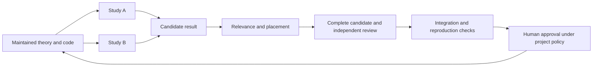

# Making AI assisted research cumulative and reviewable

These notes support a 15–20 minute research-group talk about a practical
workflow for using agents in sustained theoretical and computational work.
The organizing question is: **When generating candidate work becomes much
easier, how do we keep understanding, checking, and reusing it manageable?**

The proposed answer has four parts: a persistent working environment, isolated
exploration, explicit promotion into maintained knowledge, and deliberate
support for human understanding. The skills repository supplies reusable
procedures; each project adopts its own concrete rules.

## Opening in your own voice

> My first difficulty was losing the state of the project across chats. I kept
> producing explanations, code, and documents, and then had to reconstruct
> what we actually knew. Moving the work into a repository on a workstation
> helped with execution, persistence, and rollback.
>
> The harder problem remained: I could generate work much faster than I could
> read, verify, and understand it. Every plausible result could create more
> work for me. I needed a process that let exploration grow while keeping the
> material I was expected to trust and digest coherent.
>
> This is the workflow I developed to handle that problem. It gives uncertain
> work a place to live, sets conditions for promoting it, and makes the
> accepted material usable by the next investigation and the next person.

Present this as experience from your own work. Avoid a claim that all research
has already changed in the same way, or that the workflow's benefits have been
established by a controlled evaluation.

## Suggested sequence

| Time | Slide | One point to leave with the group |
|---|---|---|
| 0–2 min | The new bottleneck | Human attention must cover understanding, checking, selection, and integration. |
| 2–4 min | Give the project a durable home | Files, executable tools, versioning, and current records make work resumable. |
| 4–7 min | Separate studies from maintained knowledge | Provisional findings need explicit dependency boundaries. |
| 7–10 min | Promotion has two jobs | Check validity and decide what deserves a coherent permanent place. |
| 10–12 min | Make output easier to verify | Stable notation and visible reasoning reduce reconstruction work. |
| 12–15 min | Different tasks need different procedures | Research, proof, teaching, and review have different success criteria. |
| 15–18 min | Walk through one study | Show the files and decisions that turn a claim into a reusable result. |
| 18–20 min | Adopt a small version | Start with one bounded question and test whether the process helps. |

For a ten-minute slot, combine slides 2 and 3, explain only the research/proof/
teaching distinction, and use the walkthrough to illustrate promotion.

## 1 The bottleneck is the work required to trust and use a result

A chat can produce a derivation, an implementation, and a polished report.
The researcher still needs to determine whether the question was preserved,
whether the argument works, what the experiment actually tested, and what
future work may safely assume.

Each additional document can therefore impose a cost. A folder full of
plausible results can be difficult to use even when many individual passages
are helpful. The workflow should reduce repeated reconstruction: finding the
current claim, recovering its assumptions, translating its notation, locating
its evidence, and identifying obsolete conclusions.

**A useful proposed measure of success is how much reusable, understood work
we obtain per hour of human attention.** This is a design objective, not a
measured result of the current repository.

Three questions make the problem concrete for the audience:

- Can a colleague resume the investigation without reading the entire chat?
- Can we trace a displayed figure to the source, inputs, and run that made it?
- Can we identify which later claims need rechecking when an earlier result changes?

## 2 Give the project a durable home

Explain the practical progression: use an agent with access to the project
files and execution tools; keep the workspace on a suitable workstation;
version authored work; preserve experiment inputs and outputs; maintain a
short current record.

An always-on workstation can support long authorized jobs, subject to the
actual session and process setup. GPU access is useful when the project needs
it. Neither is a prerequisite for the organizational method. Here, “local”
describes the working environment and files; it does not imply that model
inference runs on the workstation.

Show this small directory sketch:

```text
AGENTS.md                       entry instructions for agents
RESEARCH_WORKFLOW.md             adopted research and acceptance rules
docs/                           maintained theory and shared notation
code/                           maintained reusable implementation
studies/<question>/              investigation and current README
data/generated/<question>/<run>/ experimental outputs
```

Git supplies version history and rollback for tracked material. It does not
establish scientific correctness or automatically retain ignored experimental
data. Reproduction also requires retrievable inputs, environment information,
and a recorded generation procedure.

The current study README should answer: What is the question? What is known?
Where is the evidence? What failed or remains open? What is the next authorized
step? Link the substantial artifacts instead of copying them into several
competing summaries.

**A study is the identity of an investigation. A task is a conversation or
working session.** Several sessions can continue one study. A new scientific
question can require a new study within an existing conversation.

## 3 Isolate uncertain dependencies while allowing exploration

The central design is a separation between exploratory studies and the
maintained theory/code that future studies are allowed to use.

A study may contain promising ideas, incomplete arguments, experimental
observations, counterexamples, or abandoned routes. These records are valuable
without being ready to become shared dependencies.

In PDE, another study cannot silently import those provisional findings. The
boundary covers reading, copied summaries, generated artifacts, and agent
messages as well as direct file references. An explicitly authorized transfer
must retain the source's version and provisional status; it cannot be called
independent rediscovery.

This addresses a concrete risk: an unverified lemma can spread through several
investigations and acquire the appearance of corroboration. Restricting that
transfer reduces opportunities for the same unsupported premise to propagate.
Shared established sources can still contain errors, so the protection is
limited rather than absolute.

The intended flow is:



The studies produce separate candidates; the diagram does not authorize them
to read each other's findings. Its central message is that promotion controls
which findings become shared dependencies.

These are instructions and operating procedures. Directory names alone do not
enforce them. Context selection, scoped assignments, review records, and human
oversight must make the information boundary real.

## 4 Promotion controls both correctness and reading burden

Promotion changes what the project permits future work to rely on. It also
determines what enters the maintained material that people must understand.

The first gate is **relevance and placement**. Is the result useful enough?
Does it duplicate something already present? What assumptions or maintenance
cost does it add? Where does it belong in the conceptual structure or API?
A correct result may remain in its study when it does not justify expanding
the maintained corpus.

Next comes a complete candidate: precise claims, actual arguments, dependencies,
reusable implementation, meaningful checks, and reproduction recipes as
appropriate. A claim of correctness or an old “PASS” does not supply this material.

For substantial additions, PDE's current policy calls for an independent
selector, two fresh complete adversarial scientific reviews, a separate fresh
integration review, and the user's approval of the concrete reviewed addition.
The reusable organization skill makes review depth configurable; this demanding
PDE policy is one project's choice, not a universal requirement for every edit.

Explain what makes those reviews meaningful:

- Reviewers receive the frozen candidate and its complete dependencies, without
  inherited author discussion, previous verdicts, or each other's reports.
- They inspect the argument and, where applicable, the experimental producer
  and implementation. They record actual checks and unresolved objections.
- A changed scientific candidate needs the applicable checks again. The old
  verdict belongs to the old version.
- The assembled result must be usable from maintained sources without private
  chat context, study-only scripts, or unexplained old arrays.

**For theory**, integration includes common definitions, notation, full proofs,
and coherent placement. **For code**, it includes usable interfaces, supported
ranges, tests, inputs, and generation/analysis commands. A fresh reproduction
executes the upstream experiment; redrawing a plot from an old array checks a
much smaller part of the chain.

Fresh contexts reduce exposure to a shared narrative. They do not establish
statistical independence between model errors or a numerical reliability
guarantee. Accepted material remains revisable. A correction should identify
affected downstream dependencies so that they can be checked again.

## 5 Readability is part of verification

The notation and teaching skills address the cost of making a human understand
the result. A short response can still be expensive to read if every line
introduces a new abbreviation or hides the central construction.

Use familiar domain objects and keep their meanings stable. Define the central
function or update rule explicitly. Derive the crucial implication. Mark the
first approximation and preserve the conditions attached to the conclusion.
When a reader identifies confusion, rebuild the affected explanation instead
of accumulating patches.

An example of the presentation standard:

> “The response operator preserves the relevant structure” is insufficient.
> Show what inputs the operator takes, its defining formula, which quantities
> change during training, and why the next equation follows.

For a result that deserves human attention, a useful presentation has three
levels: a compact statement and scope; the mechanism and difficult step; the
complete proof or reproducible evidence. These can be sections of one maintained
artifact. The short account should make the full argument easier to inspect
without taking its place.

The teaching skill helps the reader acquire understanding: it starts from the
source's concrete objects, derives rather than paraphrases, and returns to the
last understood point when confusion appears. A requested complete explanation
still receives the complete requested scope.

## 6 Skills distinguish different kinds of intellectual work

A skill is a reusable set of instructions, with supporting references where
needed. In this repository, the packages have separate purposes:

| Skill | Job | Characteristic safeguard |
|---|---|---|
| `organize-research-project` | Structure a sustained project | Separate exploration, evidence, and accepted dependencies. |
| `investigate-conjectures` | Make progress on an open question | Preserve the target, compare mechanisms, identify the decisive gap, and bound effort. |
| `solve-math-rigorously` | Solve a specified mathematical problem | Supply every necessary implication and check invoked theorem hypotheses. |
| `teach-technical-math` | Help a person understand technical sources | Derive the mathematics with stable notation and an appropriate pace. |
| `explain-with-canonical-notation` | Improve mathematical presentation across tasks | Define real objects explicitly and avoid unnecessary translation and shorthand. |
| `review-ai-paper` | Evaluate an external paper and its evidence | Separate conclusion plausibility from argument soundness; trace the impact of each defect. |
| `handoff-codex-project-tasks` | Preserve work across supported task moves | Verify identity, history, repository state, and completion rather than trusting display labels. |

The research/proof distinction is particularly useful. Open research can end
with a valid lemma, a counterexample to one route, and an unresolved central
question. A completed proof request needs the entire claimed logical chain.
Teaching has a further requirement: the human must be able to follow that chain.

Skills do not make the model infallible. They make desirable behavior explicit,
reusable, inspectable, and revisable. Project rules specify sources and authority;
task assignments specify the present goal, permitted actions, and budget.
Updating a personal skill does not silently amend a project's adopted policy.

## 7 Keep the agent on the actual question

The conjecture skill contains several safeguards worth demonstrating:

**Fix the target and forbidden shortcuts.** Specify the object, assumptions,
scope, success criterion, and information the proposed method may use. A proof
for a favorable special case is a partial result when the request concerns a
general class. An approximation that requires an unavailable future trajectory
does not establish a direct initialization algorithm.

**Identify the missing implication.** A reduction can expose useful structure.
It does not settle the question when its new assumption contains the original
difficulty. Record the exact unresolved step instead of calling it routine.

**Choose experiments by their decision value.** Identify the competing
explanations and the measurement on which they disagree. Use the smallest
setting that preserves that distinction. A toy example that removes the
mechanism cannot test it. Record validity checks, budget, and stopping rules
before running; an invalid comparison is inconclusive.

**Preserve the scope of failure.** Failure of a construction, proof technique,
or numerical run does not establish impossibility for every method. Conversely,
one successful example does not prove universality.

**Make long runs bounded.** An overnight assignment should specify a concrete
deliverable, allowed inputs, compute limits, and a stopping report. An honest
remaining gap is an acceptable outcome. Repetition and additional agents need
to serve an identifiable unresolved question.

## 8 Show one illustrative study

Use this as a hypothetical walkthrough, not as a claim about a completed PDE
experiment. The question is whether a reduced simulator preserves a reference
model's predictions throughout an evolution.

1. **Create the study record.** State the reference, observable, time horizon,
   accuracy target, permitted preprocessing, and compute budget. A final-time
   check alone does not answer a whole-trajectory question.
2. **Use maintained prerequisites.** Import the approved solver and applicable
   theorem with its assumptions checked. Avoid rebuilding an existing method
   without a reason.
3. **Expose an ambiguous success.** The reduced system fits the training data,
   but that observation leaves prediction fidelity unresolved. Record the
   missing comparison rather than upgrading the claim.
4. **Run one discriminating test.** Compare the agreed observable, with controls
   for reference accuracy and numerical error. Save source, configuration,
   inputs, seed, command, outputs, and interpretation in a fresh run location.
5. **Update only what the evidence settles.** The result could validate the
   tested case, refute this construction's claimed scope, or be inconclusive.
   Preserve any independently valid lemma or implementation.
6. **Prepare a useful candidate.** A sound restricted theorem and reusable
   implementation may warrant promotion even while the larger question stays
   open. Relevance screening decides whether they belong in the maintained work.
7. **Review and integrate.** Freeze the actual candidate, complete the required
   reviews and reproduction, and seek approval of that specific addition.
   The next study can use the accepted result within its stated conditions.

For a short screen demonstration, show a study README, its linked source and
evidence, the review's input version, and the maintained destination. Use a
real example only after confirming its actual check and promotion status.

## Further insights to mention if time permits

**Three statuses are needed.** Scientific status, checking status, and adoption
status answer different questions. For example:

| Scientific status | Checking status | Adoption status |
|---|---|---|
| Empirical result on a specified dataset | Reproduced within the study | Exploratory |
| Candidate proof under additional assumptions | Internal check complete | Proposed for integration |
| Theorem under explicit hypotheses | Required reviews complete | Accepted into maintained theory |

**The most recent summary is not automatically authoritative.** A new account
replaces an old conclusion only when it corrects the argument, assumptions,
evidence, or interpretation. Preserve the reason for the change and keep the
current account unambiguous.

**Negative results save future effort.** A failed route can leave useful
identities, code, or counterexamples. Preserve these separately from the
conclusion that failed. State what new evidence would justify reopening the route.

**A reproducible mistake is still a mistake.** Reproduction establishes that
the recorded procedure yields the reported result. Interpretation, target
fidelity, and theoretical validity need their own checks.

**Context is a controlled input.** An author, a fresh independent attempt,
a reviewer, and a teacher need different material. Supplying every agent with
the entire history can undermine independence and reintroduce superseded claims.

**More agents increase coordination obligations.** Distinct assigned files and
output locations prevent collisions. A shared checkout also requires coordinated
Git writes. PDE's exact checkout policy is local; other projects can choose a
different explicit collaboration policy.

**Keep the procedure small.** The organization skill explicitly permits one
current README instead of mandatory duplicate registries and status files.
Add records when they answer a real question about evidence or responsibility.

## Questions the group may ask

**Why not let every study read everything?** Shared maintained sources already
provide a common foundation. Unrestricted provisional sharing can make separate
attempts depend on the same unverified claim. Authorized collaboration remains
possible, with that dependency and its limits recorded.

**Will the review gates slow us down?** They cost effort. Apply the project's
chosen scrutiny where results become shared dependencies, and screen relevance
before investing in full promotion. Ordinary exploration and small repairs
need proportionate procedures. The right trade-off should be tested in practice.

**Can we trust several agents agreeing?** Agreement is useful evidence only
with coverage and concrete reasoning behind it. Shared model blind spots remain.
Human scrutiny, independent calculations, informative experiments, and formal
verification where appropriate provide different checks.

**Does reuse mean never checking a theorem again?** Routine work can reuse an
accepted result after verifying its hypotheses. A changed dependency, discovered
error, incompatible setting, or required foundational review can justify reopening it.

**Do we need to adopt Codex or your directory names?** The method needs durable
artifacts, execution when required, controlled dependencies, and explicit
acceptance rules. The names and tools can fit the group's environment. These
notes do not compare product capabilities or require a particular deployment.

**What remains the human's job?** Set the important questions, judge scientific
value and acceptable evidence, understand the central mechanism, examine crucial
claims, and decide what the group will rely on. Delegation does not remove
responsibility for those judgments.

## A small adoption exercise

Choose one bounded research question and one researcher responsible for it.
Adopt a short local workflow, create a study README, and identify the maintained
sources it may use. Pick only the relevant skills. Require an explicit outcome,
evidence links, and remaining gaps at the end of the assignment.

Then ask a colleague who did not follow the chat to resume the work or assess
one candidate result. Useful observations to record are the time needed to
find the current claim and assumptions, missing evidence, reproduction success,
and repeated work caused by unclear project state. These are proposed measures
for a pilot, not numbers already measured here.

Choose review depth before evaluating the candidate. Try one complete promotion
if the candidate is useful enough. Adjust procedures where they failed to answer
a real question or created avoidable work.

## Closing in your own voice

> The question I want us to ask is what should remain after an agent has worked
> for a day. I want the current state to be easy to recover, the important
> claims to have inspectable evidence, and the useful results to improve the
> starting point for the next investigation. That is what these workflows
> are trying to make routine.

## Sources for preparing the talk

The reusable packages are in [ajoudaki/personal-skills](https://github.com/ajoudaki/personal-skills).
The descriptions here were checked against revision
`046edcb53df6aba1ab1ab9b05110c1a8e18e75f1`.

| Topic | Primary source |
|---|---|
| Current PDE boundaries and notation requirements | [AGENTS.md](../../AGENTS.md) |
| Exact PDE check and promotion policy | [RESEARCH_WORKFLOW.md](../../RESEARCH_WORKFLOW.md) |
| Reusable organization method and configurable review depth | [Project organization skill](https://github.com/ajoudaki/personal-skills/blob/046edcb53df6aba1ab1ab9b05110c1a8e18e75f1/organize-research-project/SKILL.md) and its four reference modules |
| Target preservation and forbidden substitutions | [Research contract](https://github.com/ajoudaki/personal-skills/blob/046edcb53df6aba1ab1ab9b05110c1a8e18e75f1/investigate-conjectures/references/research-contract.md) |
| Bottlenecks, experiment design, evidence updates, and route failures | [Conjecture investigation](https://github.com/ajoudaki/personal-skills/blob/046edcb53df6aba1ab1ab9b05110c1a8e18e75f1/investigate-conjectures/SKILL.md) and its five reference modules |
| Complete proof obligations | [Rigorous mathematics](https://github.com/ajoudaki/personal-skills/blob/046edcb53df6aba1ab1ab9b05110c1a8e18e75f1/solve-math-rigorously/SKILL.md) |
| Understanding, derivation, and repairing confusion | [Technical mathematics teaching](https://github.com/ajoudaki/personal-skills/blob/046edcb53df6aba1ab1ab9b05110c1a8e18e75f1/teach-technical-math/SKILL.md) |
| Explicit objects and stable notation | [Canonical notation](https://github.com/ajoudaki/personal-skills/blob/046edcb53df6aba1ab1ab9b05110c1a8e18e75f1/explain-with-canonical-notation/SKILL.md) |
| Argument soundness, conclusion plausibility, and dependency effects | [Paper review](https://github.com/ajoudaki/personal-skills/blob/046edcb53df6aba1ab1ab9b05110c1a8e18e75f1/review-ai-paper/SKILL.md) and its severity rubric |
| Verifying task continuity and preserving repository state | [Task handoff](https://github.com/ajoudaki/personal-skills/blob/046edcb53df6aba1ab1ab9b05110c1a8e18e75f1/handoff-codex-project-tasks/SKILL.md) and its operational references |

The skills and policies document intended procedures. This talk does not claim
that every historical study followed them, or that the established corpus has
been freshly audited for this presentation. The proposed framing, timing,
walkthrough, and pilot are presentation suggestions grounded in those procedures.
